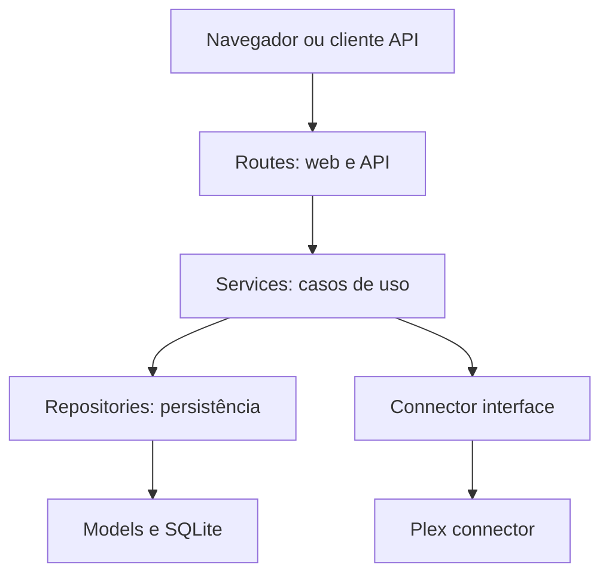

# euvieouvi v2 — Arquitetura Geral

**Status:** Entrega 2 — aprovada em 4 de agosto de 2026  
**Data:** 4 de agosto de 2026  
**Documento anterior:** `euvieouvi v2 — Visão e Escopo`, aprovado em 4 de agosto de 2026.

## 1. Objetivo desta arquitetura

Definir a estrutura estável do `euvieouvi v2` antes da implementação. Esta arquitetura atende exclusivamente ao escopo aprovado: aplicação self-hosted, Docker-first, em Python e Flask, com SQLite, interface em HTMX e Bootstrap, API REST, conector Plex inicial e sincronização incremental de filmes e episódios assistidos.

Esta entrega não define ainda o esquema detalhado do banco, os endpoints completos nem o algoritmo interno da sincronização. Esses contratos serão especificados nas entregas próprias, respeitando os limites aqui estabelecidos.

## 2. Estilo arquitetural

A aplicação será um **monólito modular em camadas**, executado inicialmente como um único serviço de aplicação e um banco SQLite local.

O monólito modular foi escolhido para:

- manter implantação e operação simples;
- evitar complexidade prematura de serviços distribuídos;
- permitir transações locais confiáveis;
- preservar limites claros entre as áreas do sistema;
- possibilitar a inclusão futura de conectores sem alterar o núcleo.

Não serão criados microsserviços nesta versão.

## 3. Visão geral dos componentes



### 3.1 Routes

Responsáveis por receber requisições HTTP, validar entradas superficiais, chamar um caso de uso e transformar o resultado em resposta HTML ou JSON.

As rotas não devem:

- implementar regras de sincronização;
- consultar SQLite diretamente;
- chamar bibliotecas do Plex diretamente;
- controlar transações de negócio.

Haverá dois grupos:

- **Web routes:** páginas e fragmentos HTMX.
- **API routes:** contratos REST em JSON.

Ambos reutilizarão os mesmos serviços. A interface web não terá uma segunda implementação das regras.

### 3.2 Services

Representam os casos de uso e concentram as regras da aplicação. Exemplos conceituais:

- configurar uma fonte Plex;
- testar uma conexão;
- descobrir bibliotecas externas;
- habilitar ou desabilitar uma biblioteca;
- iniciar uma sincronização;
- consultar o histórico armazenado;
- consultar o estado da última execução.

Os serviços coordenam conectores e repositórios, delimitam transações e convertem erros técnicos em resultados compreensíveis para as rotas.

### 3.3 Repositories

São a única porta de acesso da lógica de aplicação à persistência. Cada repositório expõe operações relacionadas ao domínio, sem vazar consultas SQL para os serviços.

Responsabilidades:

- consultar e persistir entidades;
- localizar registros por identidade interna ou referência externa;
- executar inserções e atualizações idempotentes;
- manter o estado incremental definido pelo serviço;
- participar da transação controlada pela aplicação.

### 3.4 Models

Representam a estrutura persistida e os relacionamentos internos. Os modelos não deverão conter chamadas ao Plex, tratamento HTTP ou orquestração de sincronização.

O modelo detalhado será definido na Entrega 4 — Banco de Dados.

### 3.5 Connectors

São adaptadores de leitura para serviços externos. O núcleo define uma interface neutra e cada integração fornece sua implementação.

O conector Plex será responsável por:

- autenticar-se no Plex com a configuração recebida;
- listar bibliotecas disponíveis;
- ler itens e estados assistidos das bibliotecas solicitadas;
- lidar com paginação e particularidades do Plex;
- devolver dados em estruturas neutras e tipadas;
- converter falhas do Plex em erros padronizados do conector.

O conector não poderá:

- acessar o banco;
- importar repositórios;
- decidir quais bibliotecas estão habilitadas;
- persistir progresso de sincronização;
- produzir respostas HTTP ou HTML.

## 4. Regra de dependências

As dependências apontam para dentro do núcleo, nunca para a infraestrutura externa:

| Origem | Pode depender de | Não pode depender diretamente de |
| --- | --- | --- |
| Routes | Services, esquemas de entrada e saída | SQLite, repositories concretos, Plex |
| Services | Interfaces de repositories e connectors, tipos do domínio | Flask request, HTML, SQL direto |
| Repositories | Models, sessão de banco | Routes, templates, Plex |
| Models | Tipos básicos e infraestrutura ORM definida | Routes, services, connectors |
| Plex connector | Interface de connector, cliente Plex e tipos neutros | Models persistidos, repositories, routes |
| Templates | Dados preparados pelas web routes | Banco, services ou connector |

Não serão permitidos imports circulares entre módulos.

## 5. Organização lógica do projeto

```text
euvieouvi/
├── app/
│   ├── __init__.py
│   ├── config.py
│   ├── extensions.py
│   ├── domain/
│   │   ├── entities.py
│   │   ├── enums.py
│   │   └── errors.py
│   ├── connectors/
│   │   ├── base.py
│   │   └── plex/
│   │       ├── client.py
│   │       ├── connector.py
│   │       └── mapper.py
│   ├── models/
│   ├── repositories/
│   ├── services/
│   ├── web/
│   │   ├── routes.py
│   │   ├── templates/
│   │   └── static/
│   └── api/
│       ├── routes.py
│       └── schemas.py
├── migrations/
├── tests/
│   ├── unit/
│   ├── integration/
│   └── fixtures/
├── instance/
├── Dockerfile
├── compose.yaml
├── pyproject.toml
└── README.md
```

Essa árvore define responsabilidades, não a lista final de arquivos. Subdivisões serão criadas apenas quando houver responsabilidade concreta.

## 6. Modelo de aplicação Flask

A aplicação utilizará o padrão **application factory**:

1. carregar configuração;
2. criar a instância Flask;
3. inicializar extensões;
4. registrar blueprints web e API;
5. configurar tratamento padronizado de erros;
6. disponibilizar o objeto de aplicação ao servidor HTTP.

Não haverá criação de conexões externas nem execução automática de sincronização durante o import de módulos.

## 7. Configuração

A configuração será dividida em duas categorias:

### 7.1 Configuração operacional

Definida por variáveis de ambiente ou arquivo de ambiente fornecido ao contêiner:

- modo da aplicação;
- caminho do banco SQLite;
- nível de log;
- endereço e porta de escuta;
- opções operacionais necessárias à inicialização.

### 7.2 Configuração funcional

Persistida pelo sistema quando administrada pela interface:

- dados necessários para conectar ao Plex;
- bibliotecas descobertas e seleção habilitada;
- estado necessário aos casos de uso.

Segredos não deverão aparecer em logs nem ser devolvidos integralmente pela API. O formato exato de armazenamento será decidido na entrega de infraestrutura e banco, sem introduzir um sistema de autenticação não aprovado.

## 8. Unidade de trabalho e transações

Os serviços controlarão o limite lógico das operações. Repositórios que participam do mesmo caso de uso utilizarão a mesma sessão de banco.

Para sincronização:

- dados obtidos do conector serão validados antes da persistência;
- as gravações deverão ser idempotentes;
- falhas não poderão marcar como concluído um lote incompleto;
- o limite de commit será especificado no desenho do motor de sincronização;
- o estado incremental somente avançará depois da persistência correspondente.

Essa regra evita que o conector conheça transações ou que uma rota controle commits.

## 9. Contratos neutros do conector

O núcleo definirá tipos de transferência independentes do Plex para, no mínimo:

- biblioteca externa;
- filme externo;
- série externa;
- temporada externa;
- episódio externo;
- estado ou evento de visualização;
- página ou lote de resultados;
- cursor ou marcador incremental, quando suportado pela fonte.

Esses objetos transportarão dados para os serviços, mas não serão modelos de banco. Campos exclusivos do Plex permanecerão encapsulados no conector ou em metadados externos claramente delimitados.

## 10. Fluxos principais

### 10.1 Descoberta e seleção de bibliotecas

1. Uma rota recebe a solicitação.
2. O serviço carrega a configuração da fonte.
3. O serviço chama a interface do conector.
4. O conector consulta o Plex e devolve bibliotecas neutras.
5. O serviço associa as referências externas e persiste a seleção por repositório.
6. A rota devolve HTML ou JSON.

### 10.2 Sincronização

1. A execução é solicitada pela interface, API ou mecanismo operacional aprovado posteriormente.
2. O serviço cria um registro de execução.
3. O serviço carrega somente bibliotecas habilitadas.
4. Para cada biblioteca, solicita lotes ao conector Plex.
5. O conector devolve objetos neutros, sem persistir dados.
6. O serviço valida, normaliza e entrega as operações aos repositórios.
7. Os repositórios inserem ou atualizam os registros de forma idempotente.
8. O serviço avança o estado incremental apenas após a gravação válida.
9. A execução termina com estado e resumo mínimos para diagnóstico.

### 10.3 Consulta do histórico

1. A rota recebe filtros e paginação.
2. O serviço valida os parâmetros.
3. O repositório consulta a base local.
4. O serviço prepara o resultado.
5. A web route renderiza HTML ou a API route devolve JSON.

## 11. Execução e concorrência

Nesta versão, somente uma sincronização poderá estar ativa por instalação. Uma segunda solicitação enquanto houver execução ativa deverá ser recusada ou apontar para a execução existente.

O processo web não dependerá de um broker de mensagens. A forma exata de execução em segundo plano será decidida na Entrega 3 — Infraestrutura, mantendo as seguintes restrições:

- sem Redis ou fila distribuída nesta versão;
- estado autoritativo da execução persistido localmente;
- reinício do contêiner não poderá deixar o sistema permanentemente marcado como em execução;
- a interface deverá conseguir consultar o estado sem manter uma requisição HTTP longa aberta.

## 12. Tratamento de erros

Haverá categorias estáveis de erros:

- erro de configuração;
- erro de validação;
- fonte indisponível;
- autenticação recusada pela fonte;
- recurso externo não encontrado;
- erro de persistência;
- conflito de execução;
- erro interno inesperado.

Connectors, repositories e services poderão lançar erros próprios de suas camadas. As routes os converterão em respostas HTML ou JSON coerentes. Detalhes técnicos serão registrados em log, sem exposição de segredos ao usuário.

## 13. Observabilidade mínima

A aplicação emitirá logs estruturados ou consistentemente formatados para:

- inicialização e encerramento;
- teste de conexão Plex;
- início e término de sincronização;
- biblioteca e lote em processamento;
- contadores básicos de itens lidos, inseridos, atualizados, ignorados e com erro;
- falhas com contexto suficiente para diagnóstico;
- duração da execução.

Logs não substituem o registro persistido do estado da sincronização.

## 14. Estratégia de testes

### 14.1 Testes unitários

- regras dos services;
- mapeamento Plex para contratos neutros;
- validações e normalizações;
- decisões incrementais;
- tratamento de erros.

### 14.2 Testes de integração

- repositories com SQLite temporário;
- transações e idempotência;
- rotas Flask com cliente de teste;
- integração entre service, repository e connector simulado.

### 14.3 Testes do conector

- respostas Plex representativas serão armazenadas como fixtures sanitizadas;
- testes não dependerão de um servidor Plex real para a suíte normal;
- um teste manual ou opcional poderá validar uma instalação Plex configurada pelo operador.

## 15. Decisões adiadas intencionalmente

Os seguintes detalhes serão definidos nas próximas entregas, dentro desta arquitetura:

- imagem base, servidor HTTP e volumes Docker;
- mecanismo local de execução em segundo plano;
- biblioteca ORM e estratégia de migrações;
- esquema e índices do SQLite;
- campos exatos dos contratos neutros;
- algoritmo incremental e limites de commit;
- contratos e versionamento dos endpoints;
- telas e navegação;
- estatísticas posteriores.

Integrações TMDb, Trakt e outros conectores continuam fora da primeira versão funcional.

## 16. Decisões que exigiriam mudança formal de arquitetura

Não poderão ser introduzidos durante a implementação sem aprovação explícita:

- divisão em microsserviços;
- adoção de banco servidor no lugar de SQLite;
- frontend SPA independente;
- escrita direta dos connectors no banco;
- regras de negócio em routes ou templates;
- dependência do domínio em tipos exclusivos do Plex;
- múltiplas sincronizações concorrentes;
- broker ou fila distribuída;
- novo conector na primeira versão.

## 17. Critérios de aprovação desta entrega

Esta arquitetura estará aprovada quando houver concordância explícita sobre:

- monólito modular em camadas;
- responsabilidades e proibições de cada camada;
- regra de dependências;
- estrutura lógica do projeto;
- application factory do Flask;
- separação entre configuração operacional e funcional;
- contratos neutros entre connectors e núcleo;
- sincronização única por instalação;
- limites transacionais;
- estratégia geral de erros, logs e testes;
- decisões adiadas e mudanças que exigem aprovação formal.

Após a aprovação, a próxima entrega será **Infraestrutura**, sem implementação de código de negócio.
