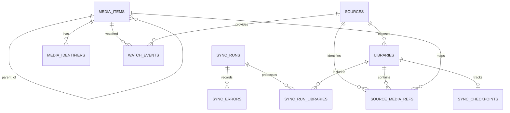

# euvieouvi v2 — Banco de Dados

**Status:** Entrega 4 — aprovada em 4 de agosto de 2026  
**Data:** 4 de agosto de 2026  
**Base:** Visão e Escopo, Arquitetura Geral e Infraestrutura aprovados em 4 de agosto de 2026.

## 1. Objetivo

Definir o modelo persistente do `euvieouvi v2`, incluindo tecnologia, entidades, relacionamentos, identidade externa, histórico assistido, estado de sincronização, integridade, índices, migrações, transações e retenção.

O banco representa o domínio da aplicação. Ele não será uma cópia das estruturas do Plex e não dependerá de nomes ou tipos exclusivos desse conector.

## 2. Tecnologia

- SQLite como banco da primeira versão.
- SQLAlchemy 2.x como ORM e camada de acesso SQL.
- Flask-SQLAlchemy somente para integração do ciclo de vida da sessão com Flask, sem uso de consultas legadas acopladas aos models.
- Alembic, integrado por Flask-Migrate, para versionamento e aplicação de migrações.
- Tipagem moderna do SQLAlchemy com `Mapped` e `mapped_column`.
- Repositories como única entrada dos services para a persistência.

O código não utilizará `Model.query`. Consultas serão explícitas com `select`, executadas pela sessão fornecida à unidade de trabalho.

## 3. Convenções gerais

### 3.1 Nomes

- Tabelas e colunas em `snake_case` e inglês.
- Tabelas no plural.
- Chaves primárias chamadas `id`.
- Chaves estrangeiras terminadas em `_id`.
- Timestamps terminados em `_at`.

### 3.2 Chaves

- Chaves internas inteiras geradas pelo SQLite.
- Identificadores externos armazenados como texto, mesmo quando a fonte os representa numericamente.
- Nenhuma chave primária interna será derivada do Plex.

### 3.3 Datas e horários

- Instantes persistidos em UTC.
- Timestamps com precisão suficiente para evitar perda de ordenação dos eventos recebidos.
- Conversão para `America/Sao_Paulo` somente na apresentação.
- Datas sem horário, como lançamento original, armazenadas separadamente como data.

### 3.4 Enumerações

Valores fechados serão representados no código por enums, persistidos como texto legível. Migrações controlarão novos valores quando necessário.

## 4. Diagrama de entidades

O diagrama mostra apenas os relacionamentos centrais. Configurações e metadados técnicos aparecem nas definições seguintes.

## 5. Tabela `sources`

Representa uma instalação externa configurada. Na primeira versão haverá somente o tipo `plex`, mas o nome da tabela e seus contratos permanecem neutros.

| Coluna | Tipo lógico | Regra |
| --- | --- | --- |
| `id` | integer | PK |
| `connector_type` | text | obrigatório; inicialmente `plex` |
| `name` | text | obrigatório; nome local da fonte |
| `base_url` | text | obrigatório |
| `secret` | text | credencial necessária ao connector |
| `enabled` | boolean | obrigatório; padrão verdadeiro |
| `created_at` | datetime UTC | obrigatório |
| `updated_at` | datetime UTC | obrigatório |
| `last_connection_test_at` | datetime UTC | opcional |
| `last_connection_status` | text | opcional |

Regras:

- `name` será único por instalação.
- `base_url` será normalizada pelo service antes de persistir.
- `secret` nunca será devolvido integralmente pela API nem registrado em log.
- O banco e o volume serão protegidos por permissões do sistema. Criptografia reversível sem uma chave externa não será apresentada como proteção real e não integra esta versão.
- A primeira versão poderá limitar a uma fonte Plex ativa, mas o esquema não imporá uma única linha global.

## 6. Tabela `libraries`

Representa uma biblioteca descoberta em uma fonte.

| Coluna | Tipo lógico | Regra |
| --- | --- | --- |
| `id` | integer | PK |
| `source_id` | integer | FK `sources.id`, obrigatório |
| `external_id` | text | identificador na fonte, obrigatório |
| `name` | text | obrigatório |
| `media_type` | text | `movie` ou `show` |
| `enabled` | boolean | padrão falso até seleção explícita |
| `available` | boolean | indica se apareceu na última descoberta |
| `discovered_at` | datetime UTC | obrigatório |
| `last_seen_at` | datetime UTC | obrigatório |
| `created_at` | datetime UTC | obrigatório |
| `updated_at` | datetime UTC | obrigatório |

Restrições:

- único por `(source_id, external_id)`;
- `media_type` limitado aos tipos aceitos na primeira versão;
- biblioteca não será apagada automaticamente quando deixar de aparecer; será marcada como indisponível;
- somente bibliotecas com `enabled = true` e `available = true` poderão iniciar sincronização normal.

## 7. Tabela `media_items`

Representa o catálogo interno e sua hierarquia.

| Coluna | Tipo lógico | Regra |
| --- | --- | --- |
| `id` | integer | PK |
| `kind` | text | `movie`, `show`, `season` ou `episode` |
| `parent_id` | integer | FK autorreferente, opcional |
| `title` | text | obrigatório |
| `original_title` | text | opcional |
| `sort_title` | text | opcional |
| `year` | integer | opcional |
| `season_number` | integer | apenas para temporada ou episódio quando aplicável |
| `episode_number` | integer | apenas para episódio |
| `duration_ms` | integer | opcional, não negativo |
| `originally_available_on` | date | opcional |
| `summary` | text | opcional |
| `created_at` | datetime UTC | obrigatório |
| `updated_at` | datetime UTC | obrigatório |

Hierarquia:

- filme não possui pai;
- série não possui pai;
- temporada possui série como pai;
- episódio possui temporada como pai;
- a relação episódio → série será obtida pela hierarquia, sem coluna duplicada obrigatória;
- regras de parentesco serão validadas pelo service e cobertas por testes; o SQLite garantirá a referência existente.

O item interno poderá continuar existindo mesmo que uma referência externa desapareça, preservando o histórico assistido.

## 8. Tabela `source_media_refs`

Liga um item interno a sua representação em uma fonte e biblioteca.

| Coluna | Tipo lógico | Regra |
| --- | --- | --- |
| `id` | integer | PK |
| `source_id` | integer | FK `sources.id`, obrigatório |
| `library_id` | integer | FK `libraries.id`, obrigatório |
| `media_item_id` | integer | FK `media_items.id`, obrigatório |
| `external_id` | text | identidade estável usada pelo connector |
| `external_key` | text | chave de acesso específica, opcional |
| `external_updated_at` | datetime UTC | opcional |
| `last_seen_at` | datetime UTC | obrigatório |
| `available` | boolean | padrão verdadeiro |
| `raw_hash` | text | opcional; detecção de mudança relevante |
| `created_at` | datetime UTC | obrigatório |
| `updated_at` | datetime UTC | obrigatório |

Restrições e finalidade:

- único por `(source_id, external_id)`;
- índice por `(library_id, available)`;
- índice por `media_item_id`;
- itens removidos da fonte serão marcados como indisponíveis, não apagados;
- `external_key` não participa da identidade se puder mudar;
- `raw_hash` não armazenará a resposta bruta, apenas uma assinatura normalizada quando útil.

## 9. Tabela `media_identifiers`

Armazena identificadores de catálogo informados pela fonte, sem realizar integração com esses provedores.

| Coluna | Tipo lógico | Regra |
| --- | --- | --- |
| `id` | integer | PK |
| `media_item_id` | integer | FK `media_items.id`, obrigatório |
| `provider` | text | exemplo: `imdb`, `tmdb`, `tvdb` |
| `external_id` | text | obrigatório |
| `created_at` | datetime UTC | obrigatório |

Restrições:

- único por `(media_item_id, provider, external_id)`;
- índices por `(provider, external_id)`;
- armazenar um identificador relatado pelo Plex não constitui integração TMDb, Trakt ou outro conector;
- esses valores ajudam a reduzir duplicidades futuras, mas não autorizam consultas externas nesta versão.

## 10. Tabela `watch_events`

Representa ocorrências assistidas conhecidas pelo sistema. O evento é separado do item de catálogo para preservar múltiplas visualizações.

| Coluna | Tipo lógico | Regra |
| --- | --- | --- |
| `id` | integer | PK |
| `media_item_id` | integer | FK `media_items.id`, obrigatório |
| `source_id` | integer | FK `sources.id`, obrigatório |
| `source_event_id` | text | identidade do evento na fonte, opcional |
| `watched_at` | datetime UTC | obrigatório |
| `completed` | boolean | obrigatório |
| `progress_ms` | integer | opcional, não negativo |
| `duration_ms` | integer | opcional, não negativo |
| `view_number` | integer | opcional; sequência informada ou inferida com segurança |
| `created_at` | datetime UTC | obrigatório |
| `updated_at` | datetime UTC | obrigatório |

Identidade e deduplicação:

- quando a fonte fornecer identidade estável do evento, haverá unicidade parcial lógica por `(source_id, source_event_id)`;
- quando não houver identidade estável, o service calculará uma chave determinística de deduplicação com os campos confiáveis disponíveis;
- essa chave será persistida em uma coluna técnica `dedup_key`, única por fonte;
- um estado agregado de “assistido” não será inventado como vários eventos;
- se o Plex fornecer apenas `view_count` e último horário para um item, esses fatos serão persistidos em `watch_states`, sem criar `watch_events` para visualizações cujas ocorrências não são conhecidas.

## 11. Tabela `watch_states`

Mantém o estado mais recente observado por item e fonte para consultas rápidas e reconciliação incremental.

| Coluna | Tipo lógico | Regra |
| --- | --- | --- |
| `id` | integer | PK |
| `media_item_id` | integer | FK `media_items.id`, obrigatório |
| `source_id` | integer | FK `sources.id`, obrigatório |
| `view_count` | integer | obrigatório, padrão zero |
| `last_watched_at` | datetime UTC | opcional |
| `completed` | boolean | obrigatório |
| `progress_ms` | integer | opcional |
| `observed_at` | datetime UTC | obrigatório |
| `created_at` | datetime UTC | obrigatório |
| `updated_at` | datetime UTC | obrigatório |

Restrições:

- único por `(media_item_id, source_id)`;
- não substitui `watch_events`;
- permite representar com fidelidade o estado agregado fornecido pelo Plex;
- atualizações não poderão reduzir silenciosamente `view_count` sem regra explícita de reconciliação.

## 12. Tabela `sync_runs`

Representa cada tentativa de sincronização.

| Coluna | Tipo lógico | Regra |
| --- | --- | --- |
| `id` | integer | PK |
| `source_id` | integer | FK `sources.id`, obrigatório |
| `trigger` | text | `manual`, `api` ou valor futuro documentado |
| `status` | text | `queued`, `running`, `succeeded`, `failed`, `interrupted` |
| `started_at` | datetime UTC | opcional até iniciar |
| `finished_at` | datetime UTC | opcional |
| `heartbeat_at` | datetime UTC | opcional |
| `items_read` | integer | padrão zero |
| `items_inserted` | integer | padrão zero |
| `items_updated` | integer | padrão zero |
| `items_unchanged` | integer | padrão zero |
| `items_failed` | integer | padrão zero |
| `events_inserted` | integer | padrão zero |
| `summary` | text | mensagem final segura, opcional |
| `created_at` | datetime UTC | obrigatório |
| `updated_at` | datetime UTC | obrigatório |

Regras:

- contadores nunca negativos;
- execução bem-sucedida exige `finished_at`;
- execução ativa será detectada por status e heartbeat;
- na inicialização, execução ativa sem executor correspondente será marcada `interrupted`;
- somente uma execução poderá adquirir o lock lógico da instalação.

## 13. Tabela `sync_run_libraries`

Detalha o resultado por biblioteca.

| Coluna | Tipo lógico | Regra |
| --- | --- | --- |
| `id` | integer | PK |
| `sync_run_id` | integer | FK `sync_runs.id`, obrigatório |
| `library_id` | integer | FK `libraries.id`, obrigatório |
| `status` | text | estados equivalentes ao processamento da biblioteca |
| `started_at` | datetime UTC | opcional |
| `finished_at` | datetime UTC | opcional |
| `items_read` | integer | padrão zero |
| `items_inserted` | integer | padrão zero |
| `items_updated` | integer | padrão zero |
| `items_failed` | integer | padrão zero |
| `message` | text | resumo seguro, opcional |

Único por `(sync_run_id, library_id)`.

## 14. Tabela `sync_checkpoints`

Armazena somente progresso confirmado para sincronização incremental.

| Coluna | Tipo lógico | Regra |
| --- | --- | --- |
| `id` | integer | PK |
| `library_id` | integer | FK `libraries.id`, obrigatório e único |
| `strategy` | text | estratégia usada pelo connector |
| `cursor` | text | cursor opaco, opcional |
| `watermark_at` | datetime UTC | marca temporal confirmada, opcional |
| `last_external_id` | text | desempate opcional |
| `last_successful_run_id` | integer | FK `sync_runs.id`, opcional |
| `updated_at` | datetime UTC | obrigatório |

Regras fundamentais:

- cursor é opaco para o repository e interpretado pelo connector/service apropriado;
- checkpoint avança somente na mesma transação que confirma a persistência do lote correspondente;
- falha ou interrupção não pode avançar além do último lote confirmado;
- cada biblioteca mantém progresso independente.

## 15. Tabela `sync_errors`

Armazena erros úteis para diagnóstico sem transformar logs completos em dados permanentes.

| Coluna | Tipo lógico | Regra |
| --- | --- | --- |
| `id` | integer | PK |
| `sync_run_id` | integer | FK `sync_runs.id`, obrigatório |
| `library_id` | integer | FK `libraries.id`, opcional |
| `media_external_id` | text | opcional |
| `category` | text | categoria padronizada |
| `message` | text | mensagem sanitizada |
| `retryable` | boolean | obrigatório |
| `occurred_at` | datetime UTC | obrigatório |

Não serão persistidos stack trace completo, token, resposta bruta que contenha segredo ou payload ilimitado. O número de erros detalhados por execução poderá ser limitado, mantendo o contador total em `sync_runs`.

## 16. Tabela `settings`

Armazena opções funcionais simples que não justificam tabela própria.

| Coluna | Tipo lógico | Regra |
| --- | --- | --- |
| `key` | text | PK |
| `value` | JSON serializado | obrigatório |
| `updated_at` | datetime UTC | obrigatório |

Regras:

- chaves permitidas serão registradas em catálogo no código;
- services validarão tipo e valor antes da persistência;
- credenciais de fontes não serão armazenadas nesta tabela genérica;
- nenhuma configuração desconhecida será aceita silenciosamente.

## 17. Relacionamentos e políticas de exclusão

| Relação | Política |
| --- | --- |
| Fonte → bibliotecas | exclusão restrita enquanto houver histórico |
| Biblioteca → referências | indisponibilidade lógica; exclusão física somente administrativa futura |
| Item → filhos | restrita se houver descendentes |
| Item → eventos/estado | restrita para preservar histórico |
| Execução → detalhes/erros | cascade apenas ao excluir deliberadamente a execução |
| Biblioteca → checkpoint | cascade permitido se a biblioteca puder ser excluída sem histórico |

Na operação normal, dados externos ausentes serão marcados como indisponíveis. Não haverá exclusão automática do histórico porque um item saiu do Plex ou uma biblioteca foi desabilitada.

## 18. Índices essenciais

Além das chaves e unicidades já citadas:

- `media_items(kind, title)` para consultas básicas;
- `media_items(parent_id, season_number, episode_number)` para hierarquia;
- `source_media_refs(source_id, external_id)` único;
- `source_media_refs(library_id, available)`;
- `media_identifiers(provider, external_id)`;
- `watch_events(media_item_id, watched_at desc)`;
- `watch_events(source_id, watched_at desc)`;
- `watch_events(source_id, dedup_key)` único;
- `watch_states(completed, last_watched_at desc)`;
- `sync_runs(status, created_at desc)`;
- `sync_run_libraries(sync_run_id, library_id)` único;
- `sync_errors(sync_run_id, occurred_at)`.

Índices adicionais dependerão de consultas reais definidas pela API e serão justificados por plano de consulta, não adicionados preventivamente.

## 19. Pragmas SQLite

Na abertura de cada conexão:

- `PRAGMA foreign_keys = ON`;
- `PRAGMA busy_timeout` conforme configuração operacional;
- `PRAGMA journal_mode = WAL` como padrão proposto;
- `PRAGMA synchronous = NORMAL` com WAL, sujeito a teste documentado;

O modo efetivo será verificado em teste de integração. Backup usará método compatível com WAL. Alterações nesses valores exigirão justificativa baseada em integridade e operação.

## 20. Transações e commits

- Routes nunca executarão commit.
- Connectors nunca abrirão sessão de banco.
- Services definirão a unidade lógica de trabalho.
- Repositories usarão a sessão recebida e não farão commits ocultos.
- Inserção ou atualização de item, referência, estado assistido, eventos e checkpoint de um lote deverá ser atomicamente consistente.
- Contadores da execução serão atualizados juntamente com o lote confirmado ou derivados de resultados confirmados.
- Erro em um item poderá ser isolado conforme política futura do motor, mas nunca produzir checkpoint que ignore trabalho não confirmado.

O tamanho dos lotes será definido na entrega do motor de sincronização e validado com uma biblioteca pequena antes de carga completa.

## 21. Idempotência

A repetição do mesmo lote deverá resultar no mesmo estado persistente:

- upsert de biblioteca por fonte e identidade externa;
- upsert da referência de mídia por fonte e identidade externa;
- atualização controlada do item interno;
- deduplicação de eventos por identidade externa ou chave determinística;
- upsert de estado assistido por item e fonte;
- checkpoint monotônico dentro da estratégia definida.

Testes cobrirão reprocessamento integral do mesmo conjunto e repetição após falha entre lotes.

## 22. Migrações

- A primeira migração criará todo o esquema aprovado.
- O banco não será criado implicitamente por `create_all` em produção.
- Cada alteração posterior terá migração Alembic versionada.
- Migrações serão aplicadas no início do contêiner antes do readiness.
- Downgrade será fornecido quando seguro; restauração de backup será o caminho para transformações irreversíveis.
- Migrações destrutivas exigirão backup e etapa explícita.
- A versão do esquema será verificada pelo readiness.

## 23. Backup e retenção

- Backup consistente pelo mecanismo oficial do SQLite.
- Restauração somente com serviço parado.
- Banco, arquivos WAL e SHM não serão copiados separadamente como método de backup.
- Histórico assistido não terá expiração automática.
- Registros de execução e erros poderão ter retenção configurável em versão futura; nesta versão não serão apagados automaticamente.
- Respostas brutas do Plex não serão armazenadas permanentemente.

## 24. Limites desta entrega

Permanecem para documentos seguintes:

- campos exatos dos DTOs recebidos do Plex;
- estratégia incremental escolhida para cada endpoint Plex;
- paginação e tamanho de lote;
- regras de merge quando identificadores externos divergem;
- endpoints REST e filtros do dashboard;
- estatísticas derivadas.

Não entram nesta versão:

- tabelas de usuários e permissões;
- cache de TMDb ou Trakt;
- recomendações;
- avaliações sociais;
- banco PostgreSQL ou outro servidor;
- armazenamento de payloads Plex completos.

## 25. Critérios de validação

O banco estará corretamente implementado quando:

1. a migração inicial criar um banco vazio válido;
2. integridade referencial estiver ativa em toda conexão;
3. filmes, séries, temporadas e episódios preservarem hierarquia válida;
4. duas fontes externas puderem referenciar o mesmo item interno sem acoplamento;
5. eventos repetidos não forem duplicados;
6. estado agregado do Plex não for convertido em eventos históricos inventados;
7. remoção externa não apagar histórico local;
8. repetição do mesmo lote for idempotente;
9. falha antes do commit não avançar checkpoint;
10. uma execução interrompida puder ser reconciliada;
11. consultas básicas utilizarem os índices previstos;
12. backup e restauração preservarem integridade;
13. credenciais não aparecerem em logs nem respostas;
14. migrations, e não `create_all`, controlarem produção.

## 26. Decisões que exigiriam alteração formal

- substituir SQLite;
- permitir acesso direto dos connectors ao banco;
- usar identidade Plex como chave primária interna;
- eliminar a distinção entre item, evento e estado assistido;
- fabricar eventos para completar um `view_count` sem datas conhecidas;
- apagar automaticamente histórico quando o conteúdo desaparecer da fonte;
- incluir usuários, TMDb, Trakt ou estatísticas avançadas nesta fase;
- armazenar respostas externas brutas sem limite;
- permitir commits ocultos em repositories.

## 27. Critérios de aprovação desta entrega

Esta entrega estará aprovada quando houver concordância explícita sobre:

- SQLAlchemy 2.x, Flask-SQLAlchemy e Alembic/Flask-Migrate;
- identidade interna independente das fontes;
- hierarquia unificada em `media_items`;
- referências externas separadas;
- distinção entre `watch_events` e `watch_states`;
- preservação fiel de fatos sem inventar eventos;
- entidades de fontes, bibliotecas, execuções, erros e checkpoints;
- políticas de indisponibilidade e exclusão;
- índices, pragmas e limites transacionais;
- migrações e backup;
- decisões excluídas ou que exigem mudança formal.

Após a aprovação, a próxima entrega será **Motor de Sincronização e Contratos do Plex**.
