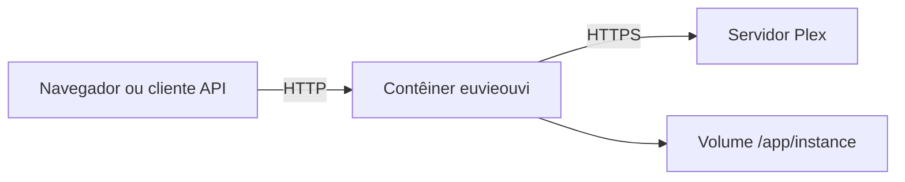

# euvieouvi v2 — Infraestrutura

**Status:** Entrega 3 — aprovada em 4 de agosto de 2026  
**Data:** 4 de agosto de 2026  
**Base:** Visão e Escopo e Arquitetura Geral aprovados em 4 de agosto de 2026.

## 1. Objetivo

Definir como o `euvieouvi v2` será construído, iniciado, configurado, persistido, observado e mantido em uma instalação self-hosted. Esta entrega fixa a infraestrutura necessária ao escopo aprovado, sem definir o esquema detalhado do banco ou implementar regras de negócio.

## 2. Topologia aprovada para a proposta

A primeira versão terá um único serviço de aplicação e um volume persistente:

Não haverá Redis, broker, banco externo, worker distribuído ou microsserviço.

## 3. Artefatos de implantação

O projeto fornecerá:

- `Dockerfile` para construir a imagem da aplicação;
- `compose.yaml` como forma principal de implantação;
- `.env.example` somente com opções operacionais não secretas ou valores de exemplo;
- `.dockerignore` para impedir o envio de arquivos locais desnecessários ao contexto de build;
- `pyproject.toml` com dependências fixadas de maneira reproduzível;
- comandos documentados para iniciar, parar, atualizar, verificar logs e fazer backup.

O arquivo de composição será suficiente para uma instalação padrão, sem exigir que o operador instale Python no host.

## 4. Imagem Docker

### 4.1 Base

- Imagem oficial Python em variante `slim`.
- Versão principal e secundária de Python explicitamente fixadas no `Dockerfile`.
- Dependências de sistema limitadas ao que for comprovadamente necessário.
- Instalação de pacotes Python sem ferramentas de desenvolvimento na imagem final, quando possível.

### 4.2 Usuário e diretórios

- A aplicação não executará como `root`.
- Será criado um usuário próprio dentro da imagem.
- Código instalado em `/app`.
- Dados mutáveis concentrados em `/app/instance`.
- Arquivos temporários usarão diretório próprio e não serão tratados como persistentes.

### 4.3 Build reproduzível

- Dependências terão versões controladas.
- O build não incluirá banco, `.env`, logs, caches, repositório Git ou credenciais.
- A imagem não executará sincronização ou migração durante o build.
- O processo de inicialização validará configuração e banco antes de aceitar tráfego.

## 5. Processo HTTP

A aplicação Flask será servida em produção pelo **Gunicorn**, usando:

- um único processo worker;
- classe `gthread`;
- múltiplas threads em quantidade configurável;
- bind padrão em `0.0.0.0:8000` dentro do contêiner;
- logs de acesso e erro enviados para `stdout` e `stderr`.

O uso de um único worker é uma decisão consciente desta versão: mantém um único coordenador local de sincronização e evita que diferentes processos aceitem simultaneamente o mesmo trabalho. A capacidade esperada é de uma instalação pessoal, em que o processamento pesado é a sincronização e não um grande volume de requisições web.

A quantidade de threads não autoriza sincronizações paralelas; o bloqueio lógico continuará sendo controlado pela aplicação e pelo estado persistido.

## 6. Execução da sincronização em segundo plano

### 6.1 Mecanismo

A primeira versão usará um executor local em memória, pertencente ao único processo da aplicação, com capacidade para **uma tarefa de sincronização por vez**.

Quando a interface ou API solicitar sincronização:

1. o serviço tentará adquirir o direito exclusivo de execução no banco;
2. criará o registro persistido da execução;
3. enviará o trabalho ao executor local;
4. devolverá imediatamente o identificador e o estado da execução;
5. a interface consultará o estado por requisições curtas, inclusive via HTMX;
6. o executor atualizará progresso e resultado no banco.

### 6.2 Restrições

- Não haverá fila durável genérica nesta versão.
- Uma segunda solicitação não criará outro trabalho enquanto houver sincronização ativa.
- O executor não será iniciado durante imports de módulos nem pelo processo de build.
- A sincronização deverá usar o contexto da aplicação de forma explícita.
- Exceções da tarefa serão capturadas, registradas e refletidas no estado persistido.

### 6.3 Recuperação após reinício

Na inicialização, a aplicação verificará execuções deixadas em estado ativo. Como o executor anterior não sobrevive ao reinício, essas execuções serão marcadas como **interrompidas**, com motivo e horário de recuperação.

A aplicação não retomará automaticamente um lote no meio. Uma nova sincronização incremental poderá ser iniciada, utilizando apenas o estado confirmado antes da interrupção.

## 7. Persistência e volume

O volume persistente será montado em `/app/instance` e armazenará:

- banco SQLite principal;
- arquivos auxiliares persistentes estritamente necessários;
- possíveis arquivos de backup criados pelo procedimento documentado.

Código, templates e arquivos estáticos permanecerão na imagem, não no volume.

No `compose.yaml`, a instalação padrão utilizará um **volume Docker nomeado**. A documentação também mostrará como substituir por bind mount quando o operador precisar acessar diretamente os arquivos no host.

O nome e o caminho do arquivo SQLite serão configuráveis, mas o padrão ficará dentro de `/app/instance`.

## 8. SQLite em operação

As seguintes regras de infraestrutura serão aplicadas:

- conexões abertas por unidade de trabalho e corretamente encerradas;
- timeout de espera para bloqueios configurado;
- integridade referencial habilitada;
- modo WAL avaliado e adotado como padrão se os testes de volume e backup confirmarem o comportamento esperado;
- apenas um processo de aplicação escrevendo no banco nesta versão;
- migrações executadas de forma controlada antes de liberar a aplicação.

A Entrega 4 definirá engine, ORM, migrações, tabelas, índices e pragmas exatos.

## 9. Inicialização do contêiner

A sequência será:

1. validar variáveis operacionais obrigatórias;
2. garantir acesso de leitura e escrita ao diretório persistente;
3. verificar a existência e compatibilidade do banco;
4. aplicar migrações pendentes de forma controlada;
5. reconciliar execuções interrompidas;
6. iniciar o Gunicorn;
7. responder ao healthcheck somente quando a aplicação estiver pronta.

Falhas em configuração, permissões ou migração deverão encerrar o contêiner com código diferente de zero e mensagem objetiva no log.

Não será utilizada uma espera artificial fixa para considerar a aplicação pronta.

## 10. Configuração operacional

As variáveis previstas nesta etapa são:

| Variável | Finalidade | Padrão conceitual |
| --- | --- | --- |
| `EUVIEOUVI_ENV` | Ambiente operacional | `production` |
| `EUVIEOUVI_HOST` | Bind interno | `0.0.0.0` |
| `EUVIEOUVI_PORT` | Porta interna | `8000` |
| `EUVIEOUVI_DATABASE_PATH` | Caminho do SQLite | `/app/instance/euvieouvi.db` |
| `EUVIEOUVI_LOG_LEVEL` | Nível de log | `INFO` |
| `EUVIEOUVI_TIMEZONE` | Fuso para apresentação e agenda futura | `America/Sao_Paulo` |
| `EUVIEOUVI_GUNICORN_THREADS` | Threads HTTP | valor conservador documentado |
| `EUVIEOUVI_DB_BUSY_TIMEOUT` | Espera por lock SQLite | valor definido após testes |

Os nomes finais serão mantidos consistentes no código, composição e documentação. Valores ainda dependentes de teste não serão fixados arbitrariamente nesta entrega.

Configuração funcional do Plex e seleção de bibliotecas continuará administrada pela aplicação, não pelo `compose.yaml`.

## 11. Rede e exposição

- O contêiner aceitará HTTP na porta interna 8000.
- A porta do host será configurável no `compose.yaml`.
- A aplicação deverá funcionar diretamente na rede local ou atrás de proxy reverso.
- TLS será responsabilidade do proxy reverso quando utilizado.
- O contêiner precisará de saída de rede para alcançar o servidor Plex configurado.
- Nenhuma porta adicional será necessária.

Configuração específica para um proxy ou domínio particular não fará parte do núcleo.

## 12. Healthchecks

Haverá duas verificações conceituais:

### 12.1 Liveness

Confirma que o processo HTTP está respondendo. Não consulta o Plex e não executa operação pesada.

### 12.2 Readiness

Confirma que:

- a aplicação terminou a inicialização;
- o banco pode ser acessado;
- a versão do esquema é compatível.

A indisponibilidade momentânea do Plex não tornará a aplicação local indisponível nem falhará o healthcheck do contêiner.

## 13. Logs

- Logs enviados a `stdout` e `stderr`.
- Um evento por linha, com timestamp, nível, componente, mensagem e contexto relevante.
- Horários internos registrados de forma inequívoca; apresentação ao usuário respeita o fuso configurado.
- Tokens, cabeçalhos de autorização, URLs contendo credenciais e segredos nunca serão registrados.
- Stack traces aparecerão para erros inesperados, preservando mensagem segura para a interface.
- Rotação e retenção dos logs serão responsabilidade do runtime Docker ou do operador.

Não será criado arquivo de log persistente por padrão.

## 14. Backup e restauração

O banco SQLite não deverá ser copiado de maneira ingênua enquanto houver escrita ativa.

O procedimento oficial utilizará um dos métodos seguros definidos após a escolha da biblioteca de banco:

- API de backup do SQLite; ou
- comando de backup consistente executado com acesso controlado ao banco.

A documentação incluirá:

- criação de backup;
- identificação do arquivo produzido;
- restauração com o serviço parado;
- validação básica após restauração;
- recomendação de cópia do backup para fora do volume do contêiner.

Backup automático agendado não integra a primeira versão funcional, mas o procedimento manual seguro é obrigatório.

## 15. Atualização da aplicação

O fluxo esperado será:

1. criar backup consistente;
2. obter ou construir a nova imagem;
3. recriar o contêiner preservando o volume;
4. aplicar migrações compatíveis durante a inicialização;
5. verificar readiness e logs;
6. manter o backup anterior até a validação.

Migrações destrutivas deverão ter estratégia explícita e não serão executadas silenciosamente apenas porque uma imagem foi atualizada.

## 16. Segurança operacional mínima

- Processo sem privilégios de root.
- Imagem sem credenciais embutidas.
- Segredos ocultados dos logs e das respostas.
- Dependências controladas e atualizáveis.
- Superfície de rede limitada a uma porta HTTP.
- Validação de entradas e limites de tamanho nas camadas apropriadas.
- Arquivos do volume com permissões compatíveis com o usuário da aplicação.

Autenticação de usuários e autorização não foram aprovadas como parte desta primeira versão e não serão introduzidas implicitamente pela infraestrutura. Se a aplicação for exposta além de uma rede confiável, o operador deverá protegê-la no proxy até que esse escopo seja formalmente definido.

## 17. Ambientes

### 17.1 Desenvolvimento

- execução local ou por composição específica de desenvolvimento;
- reload somente no ambiente de desenvolvimento;
- SQLite e fixtures isolados;
- logs mais detalhados;
- nenhuma credencial real incluída no repositório.

### 17.2 Testes

- banco temporário por suíte ou teste conforme a camada;
- connector Plex simulado por padrão;
- testes independentes do volume de produção;
- variáveis próprias e determinísticas.

### 17.3 Produção

- imagem imutável;
- Gunicorn;
- volume persistente;
- debug e reload desabilitados;
- healthcheck ativo;
- política de reinício Docker configurada.

## 18. Critérios de validação da infraestrutura

A infraestrutura estará implementada corretamente quando for possível:

1. construir a imagem de forma reproduzível;
2. iniciar a aplicação com `docker compose up -d`;
3. persistir o banco após recriação do contêiner;
4. executar o processo como usuário não root;
5. obter resposta de liveness e readiness;
6. iniciar uma sincronização em segundo plano sem bloquear a requisição HTTP;
7. impedir uma segunda sincronização concorrente;
8. reiniciar durante uma execução e reconciliá-la como interrompida;
9. consultar logs sem acessar arquivos internos;
10. criar e restaurar um backup consistente;
11. atualizar a imagem sem perder o volume;
12. operar atrás de um proxy reverso sem mudança no código.

## 19. Decisões que exigiriam alteração formal

- mais de um worker de processo;
- separação entre serviço web e worker;
- Redis, broker ou fila distribuída;
- banco externo;
- armazenamento de dados fora do volume definido;
- múltiplas sincronizações simultâneas;
- autenticação incorporada sem mudança de escopo;
- backup automático como requisito desta primeira versão.

## 20. Critérios de aprovação desta entrega

Esta entrega estará aprovada quando houver concordância explícita sobre:

- serviço único e volume persistente;
- imagem Python `slim` e processo não root;
- Gunicorn com um worker `gthread`;
- executor local com uma sincronização por vez;
- recuperação de execuções interrompidas;
- persistência em `/app/instance`;
- configuração por variáveis operacionais;
- healthchecks independentes do Plex;
- logs em `stdout` e `stderr`;
- backup manual consistente;
- atualização preservando o volume;
- limites de segurança e decisões que exigem mudança formal.

Após a aprovação, a próxima entrega será **Banco de Dados**.
