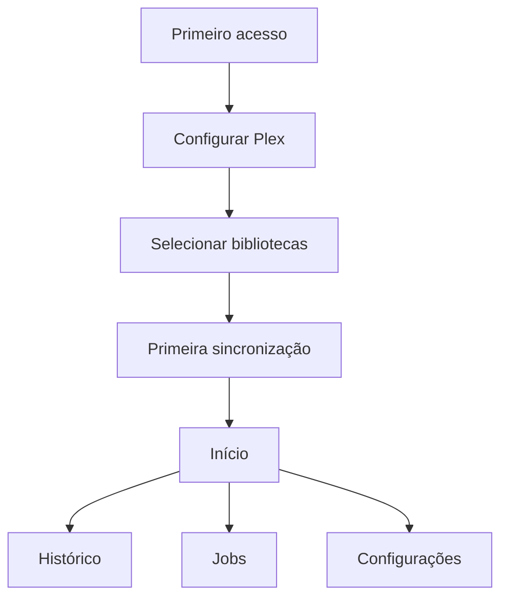

# euvieouvi v2 — Interface Web

**Status:** Entrega 7 — aprovada em 4 de agosto de 2026  
**Data:** 4 de agosto de 2026  
**Base:** Entregas 1 a 6 aprovadas em 4 de agosto de 2026.

## 1. Objetivo

Definir a interface web da primeira versão funcional do `euvieouvi v2`. A interface permitirá configurar o Plex, escolher bibliotecas, iniciar e acompanhar sincronizações e consultar o histórico local de filmes e episódios.

A experiência será simples, responsiva e renderizada no servidor. HTMX será usado apenas para atualizações parciais que realmente melhoram o fluxo, sem transformar a aplicação em SPA.

## 2. Princípios

1. Jinja renderiza páginas e fragmentos HTML.
2. HTMX atualiza regiões específicas sem duplicar regras de negócio.
3. Bootstrap fornece layout e componentes acessíveis como base.
4. Web routes e API routes usam os mesmos services.
5. A interface funciona com navegação tradicional mesmo quando uma melhoria HTMX falhar.
6. Nenhum segredo é exibido após ser salvo.
7. A aplicação diferencia claramente evento real, estado agregado e item não assistido.
8. A primeira versão evita gráficos, rankings e estatísticas avançadas.
9. A sincronização nunca mantém uma requisição HTTP longa aberta.
10. Operações destrutivas não serão apresentadas.

## 3. Tecnologia visual

- Templates Jinja.
- HTMX.
- Bootstrap.
- Ícones em conjunto local e consistente, sem dependência obrigatória de CDN.
- CSS próprio pequeno, organizado sobre variáveis do Bootstrap.
- JavaScript próprio apenas para funções que HTMX e Bootstrap não resolvam.

Bootstrap, HTMX, ícones e fontes necessárias serão servidos localmente pela aplicação. A interface continuará utilizável em uma rede sem acesso à internet.

## 4. Idioma e formatos

- Idioma inicial da interface: **português do Brasil**.
- Textos ficarão centralizados para evitar strings dispersas, mas um sistema completo de tradução não integra a primeira versão.
- Datas e horários serão apresentados em `America/Sao_Paulo` por padrão configurado.
- Valores persistidos continuam em UTC.
- Números e datas usarão formatação pt-BR.
- Termos técnicos inevitáveis, como Plex, API e ID, serão mantidos quando mais claros.

## 5. Estrutura global

### 5.1 Cabeçalho

- marca textual `euvieouvi`;
- indicador discreto quando houver sincronização ativa;
- botão para abrir navegação compacta em telas pequenas.

### 5.2 Navegação principal

- Início;
- Histórico;
- Jobs;
- Bibliotecas;
- Configurações.

### 5.3 Área de conteúdo

- título da página;
- descrição curta apenas quando necessária;
- ações principais alinhadas ao contexto;
- mensagens de sucesso ou erro próximas da operação;
- conteúdo com largura confortável em desktop e ocupação integral em celular.

### 5.4 Rodapé

- versão da aplicação;
- estado local básico;
- link para informações da instalação.

## 6. Mapa de navegação

Após a configuração inicial, o usuário sempre entra em `Início`. Se faltar uma etapa obrigatória, o dashboard mostra uma chamada de ação clara, sem redirecionamentos inesperados em ciclo.

## 7. Rotas web

| Método | Caminho | Finalidade |
| --- | --- | --- |
| GET | `/` | dashboard básico |
| GET | `/setup` | início guiado quando não há fonte configurada |
| GET, POST | `/settings/plex` | criar ou alterar a fonte Plex |
| POST | `/settings/plex/test` | testar conexão |
| GET | `/libraries` | listar e selecionar bibliotecas |
| POST | `/libraries/discover` | atualizar descoberta |
| POST | `/libraries/{id}/selection` | habilitar ou desabilitar |
| GET, POST | `/jobs` | listar, configurar e agendar operações |
| POST | `/jobs/{job_id}/run` | iniciar um job |
| GET | `/jobs/sync-runs/{id}/fragment` | acompanhar uma sincronização no modal |
| POST | `/jobs/sync-runs/{id}/cancel` | solicitar cancelamento |
| GET | `/history` | consultar histórico e catálogo assistido |
| GET | `/media/{id}` | detalhar filme, série ou episódio |
| GET | `/about` | versão e informações operacionais seguras |

POSTs de web routes usarão padrão post/redirect/get quando a resposta for uma página completa. Requisições HTMX poderão devolver fragmento equivalente.

## 8. Primeiro acesso

O primeiro acesso terá fluxo guiado, sem wizard complexo:

### Etapa 1 — Plex

Campos:

- nome local da fonte;
- URL do servidor;
- token Plex;
- fonte habilitada.

Ações:

- Salvar e testar;
- Testar conexão;
- Cancelar apenas se já existir configuração válida.

Ao editar uma fonte existente, o campo token aparece vazio com indicação “token já configurado”. Deixá-lo vazio mantém o valor existente.

### Etapa 2 — Bibliotecas

Após conexão válida:

- descobrir bibliotecas;
- mostrar somente tipos suportados como selecionáveis;
- apresentar nome, tipo, disponibilidade e seleção;
- não habilitar nenhuma biblioteca automaticamente;
- exigir ao menos uma biblioteca antes da primeira sincronização.

### Etapa 3 — Primeira sincronização

- mostrar bibliotecas selecionadas;
- explicar que o processo ocorre em segundo plano;
- iniciar a execução;
- levar à tela de acompanhamento;
- liberar o dashboard mesmo se a execução falhar, exibindo ação para diagnóstico e nova tentativa.

## 9. Página Início

O dashboard básico conterá:

### 9.1 Estado de configuração

Quando incompleto, um único painel prioritário informa a próxima ação:

- configurar Plex;
- testar conexão;
- descobrir bibliotecas;
- selecionar biblioteca;
- executar primeira sincronização.

### 9.2 Resumo do catálogo

Cards simples:

- filmes conhecidos;
- séries conhecidas;
- episódios conhecidos;
- filmes assistidos;
- episódios assistidos.

Não haverá gráfico nesta versão.

### 9.3 Sincronização

- última execução;
- status;
- início e duração;
- itens inseridos, atualizados, inalterados e com erro;
- botão `Sincronizar agora` quando permitido;
- link para detalhes.

### 9.4 Atividade recente

Lista curta de eventos assistidos realmente conhecidos, com:

- título;
- série, temporada e episódio quando aplicável;
- data e hora;
- indicação de conclusão.

Estado agregado sem ocorrência conhecida não aparece como atividade inventada.

## 10. Página Configurações do Plex

Elementos:

- estado configurado/desabilitado;
- nome;
- URL;
- token como campo de escrita, nunca revelado;
- status e horário do último teste;
- botão `Testar conexão`;
- botão `Salvar`;
- link para bibliotecas após teste bem-sucedido.

Estados do teste:

- não testado;
- testando;
- conectado;
- autenticação recusada;
- servidor indisponível;
- timeout;
- resposta inválida.

Mensagens orientam a correção sem expor token ou resposta técnica completa.

## 11. Página Bibliotecas

### 11.1 Cabeçalho

- fonte atual;
- horário da última descoberta;
- botão `Atualizar bibliotecas`;
- resumo de disponíveis e selecionadas.

### 11.2 Lista

Cada linha apresenta:

- nome;
- tipo: Filmes ou Séries;
- disponibilidade;
- chave de seleção;
- último horário visto na descoberta.

A seleção será enviada individualmente por HTMX. Durante a requisição, somente o controle correspondente fica indisponível.

### 11.3 Estados especiais

- biblioteca nova: não selecionada;
- biblioteca desaparecida: indisponível e seleção bloqueada;
- tipo não suportado: visível apenas em resumo da descoberta, sem controle de seleção;
- erro de descoberta: lista anterior preservada e aviso claro.

Nenhum item da biblioteca de mídia será carregado nesta página.

## 12. Sincronizações na página Jobs

### 12.1 Execução ativa

Painel com:

- status;
- biblioteca atual;
- início e duração;
- itens lidos;
- inseridos;
- atualizados;
- inalterados;
- erros;
- botão `Cancelar`;
- horário da última atualização.

O painel é aberto em modal pelo botão `Acompanhar` dos jobs Plex e Jellyfin. Ele será atualizado por polling HTMX em intervalo moderado enquanto a execução estiver ativa. O polling para automaticamente quando a execução terminar ou o modal deixar de existir.

### 12.2 Histórico de execuções

Tabela paginada com:

- ID;
- início;
- origem do gatilho;
- status;
- duração;
- bibliotecas;
- contadores principais;
- link de detalhes.

### 12.3 Detalhe

- resumo geral;
- resultado por biblioteca;
- último checkpoint confirmado;
- erros sanitizados;
- explicação para `interrupted`;
- ação `Sincronizar novamente` quando não houver outra execução ativa.

## 13. Página Histórico

O nome “Histórico” representa a consulta do conteúdo assistido e de seu estado local.

### 13.1 Filtros

- busca por título;
- tipo: Todos, Filmes, Séries ou Episódios;
- estado: Todos, Assistidos, Em andamento ou Não assistidos;
- biblioteca;
- período assistido;
- ordenação por último assistido, título ou ano.

Filtros serão refletidos na URL para permitir recarregar, voltar e compartilhar dentro da rede local.

### 13.2 Resultados

Desktop: tabela ou lista densa legível.  
Celular: cards compactos.

Cada resultado mostra:

- título;
- ano;
- hierarquia da série quando aplicável;
- estado assistido;
- progresso quando conhecido;
- `view_count` conhecido;
- último horário assistido;
- biblioteca ou fonte de origem.

### 13.3 Paginação

Botão `Carregar mais` por HTMX ou navegação tradicional por próxima página. Não haverá rolagem infinita automática.

### 13.4 Estado vazio

Mensagens diferentes para:

- nenhuma sincronização concluída;
- nenhum resultado para os filtros;
- biblioteca selecionada sem itens;
- execução anterior com falha.

## 14. Detalhe de mídia

### Filme

- título, ano, duração e resumo;
- estado assistido;
- progresso;
- quantidade conhecida de visualizações;
- eventos reais conhecidos;
- referências externas sanitizadas;
- disponibilidade atual.

### Série

- título e resumo;
- contagem local de temporadas e episódios;
- episódios assistidos e conhecidos;
- lista de temporadas;
- nenhuma conclusão geral obrigatória para representar episódios assistidos.

### Temporada

- série pai;
- número;
- lista de episódios e estados.

### Episódio

- série, temporada e número;
- título, duração e resumo;
- estado, progresso e eventos conhecidos.

Não haverá botões para marcar, desmarcar ou editar manualmente o histórico nesta versão.

## 15. Componentes reutilizáveis

- barra de navegação;
- flash/alert seguro;
- status badge;
- card de métrica;
- botão com estado carregando;
- tabela responsiva;
- formulário com erro por campo;
- paginação por cursor;
- estado vazio;
- resumo de sincronização;
- linha de biblioteca;
- item de histórico;
- confirmação não destrutiva de cancelamento.

Fragments serão pequenos e orientados por responsabilidade, sem criar um sistema de componentes paralelo ao Jinja.

## 16. Convenções HTMX

- Requisições de escrita incluem token CSRF.
- O servidor decide o HTML final; o cliente não reconstrói dados de negócio.
- Cada fragmento terá alvo estável.
- Indicadores de carregamento usarão `aria-busy` e conteúdo visível.
- Erro de validação devolve o formulário com campos preservados e mensagens.
- Erro global devolve alert apropriado e status HTTP coerente.
- Redirecionamento HTMX será usado somente após operação concluída.
- Histórico do navegador será atualizado apenas em filtros e navegação que representem uma página significativa.
- Polling ocorre somente para execução ativa.
- Sem WebSocket ou Server-Sent Events nesta versão.

## 17. Formulários e validação

- Labels visíveis para todos os campos.
- Texto de ajuda associado semanticamente.
- Erro junto ao campo e resumo no topo quando necessário.
- Valor inválido preservado, exceto segredos.
- Botão principal não dependerá apenas de cor.
- Duplo envio será bloqueado visualmente e tratado idempotentemente pelo servidor.
- Validação do navegador melhora a experiência, mas o servidor permanece autoritativo.

## 18. CSRF e segurança do navegador

Mesmo sem login interno, todas as web routes que alteram estado terão proteção CSRF.

- token em formulários tradicionais;
- cabeçalho apropriado em requisições HTMX;
- cookies, quando usados, com `HttpOnly`, `SameSite` e `Secure` quando houver HTTPS;
- política de conteúdo compatível com assets locais;
- ausência de HTML externo não sanitizado;
- URLs Plex e mensagens externas sempre escapadas;
- nenhum token inserido em atributo HTML, query string ou fragmento.

A proteção CSRF não substitui a obrigação de manter a aplicação em rede confiável ou atrás de proxy protegido.

## 19. Acessibilidade

Meta mínima: conformidade prática com WCAG 2.1 nível AA nos fluxos principais.

- navegação completa por teclado;
- foco visível;
- ordem de foco previsível;
- link para pular ao conteúdo;
- contraste adequado;
- labels e mensagens associados;
- status não comunicado apenas por cor;
- região `aria-live` para resultados assíncronos importantes;
- tabelas com cabeçalhos corretos;
- modais evitados quando uma página ou painel simples for suficiente;
- animações respeitam preferência de movimento reduzido.

## 20. Responsividade

### Celular

- navegação recolhível;
- cards em uma coluna;
- tabelas críticas convertidas em linhas/cards ou rolagem controlada;
- alvos de toque confortáveis;
- ação primária visível sem exigir precisão excessiva.

### Tablet

- duas colunas quando houver espaço;
- filtros recolhíveis;
- tabelas simplificadas.

### Desktop

- largura máxima confortável;
- cards resumidos em linha;
- filtros e resultados lado a lado apenas quando melhorar a leitura;
- tabelas com todas as colunas úteis.

Não haverá layout específico para televisão nesta versão.

## 21. Estados visuais padronizados

| Estado | Tratamento |
| --- | --- |
| `queued` | neutro, aguardando início |
| `running` | destaque informativo e progresso |
| `succeeded` | sucesso |
| `failed` | erro com ação de detalhes |
| `interrupted` | aviso, distinguido de falha de dados |
| indisponível | neutro/aviso, nunca sucesso |
| desabilitado | controle e texto atenuados |

Ícone, texto e cor serão combinados; cor isolada não comunicará estado.

## 22. Feedback e mensagens

Mensagens devem responder:

- o que aconteceu;
- se algo foi salvo;
- qual ação é possível agora;
- onde consultar detalhes.

Exemplos:

- `Conexão com o Plex realizada com sucesso.`
- `A configuração foi salva, mas o servidor Plex não respondeu ao teste.`
- `A sincronização já está em execução.`
- `A execução foi interrompida durante o reinício. Os dados confirmados foram preservados.`
- `Nenhum evento histórico foi informado para este item; apenas o estado agregado está disponível.`

Mensagens não mostrarão exceções técnicas.

## 23. Assets e desempenho

- Assets com hash de conteúdo para cache longo.
- HTML e fragments sem cache privado prolongado por padrão.
- CSS e JavaScript minificados no build de produção quando o processo for simples e reproduzível.
- Nenhuma imagem externa obrigatória.
- Dashboard evita consultas repetidas por card.
- Listas sempre paginadas.
- Polling adapta ou encerra quando não necessário.
- Templates não executam consultas ao banco.

Capas e imagens de mídia não integram a primeira versão, evitando proxy, cache e dependência externa ainda não aprovados.

## 24. Aparência

- Visual limpo, discreto e funcional.
- Tema claro como padrão inicial.
- Paleta com contraste adequado.
- Uso moderado de cor para estados e ações.
- Tipografia de sistema para carregamento rápido e privacidade.
- Bordas e sombras discretas.
- Densidade suficiente para bibliotecas grandes, sem aparência de painel corporativo excessivamente carregado.

Tema escuro não integra o requisito da primeira versão e poderá ser avaliado depois.

## 25. Tratamento de erros por página

### Erro recuperável de fragmento

Mantém o conteúdo anterior e mostra mensagem no componente.

### Sessão de banco indisponível

Página de erro local, request ID e orientação para verificar logs; healthcheck reflete indisponibilidade.

### Plex indisponível

Configuração, descoberta ou sincronização mostra falha. Histórico local e dashboard continuam disponíveis.

### Recurso não encontrado

Página 404 própria, sem stack trace.

### Erro inesperado

Página 500 segura com request ID.

## 26. Testes obrigatórios

### 26.1 Fluxos

- primeiro acesso completo;
- configuração existente com token preservado;
- teste Plex bem-sucedido e falho;
- descoberta e seleção;
- primeira sincronização;
- execução ativa e polling;
- conflito ao iniciar outra;
- cancelamento;
- histórico vazio e populado;
- série parcialmente assistida;
- detalhe de episódio;
- Plex indisponível com consulta local funcional.

### 26.2 HTMX e fallback

- fragmentos corretos;
- targets e swaps;
- erros de validação;
- polling interrompido no fim;
- navegação tradicional sem cabeçalho HTMX;
- post/redirect/get;
- CSRF ausente ou inválido.

### 26.3 Acessibilidade

- navegação por teclado;
- foco após atualização HTMX;
- labels e mensagens;
- regiões de status;
- contraste;
- estrutura de headings;
- tabelas responsivas;
- teste automatizado complementado por revisão manual.

### 26.4 Responsividade

- larguras representativas de celular, tablet e desktop;
- formulários sem corte;
- tabelas utilizáveis;
- botões acessíveis;
- textos longos e estados de erro.

## 27. Critérios de conclusão

A interface estará concluída quando:

1. o primeiro acesso puder configurar Plex e bibliotecas;
2. o token nunca for reexibido;
3. uma sincronização puder ser iniciada e acompanhada sem requisição longa;
4. concorrência e cancelamento forem apresentados corretamente;
5. histórico e catálogo puderem ser filtrados e paginados;
6. série parcial mostrar episódios assistidos individualmente;
7. eventos e estados agregados não forem confundidos;
8. consultas locais continuarem disponíveis sem Plex;
9. os fluxos principais funcionarem em celular e desktop;
10. formulários tiverem CSRF e validação segura;
11. navegação e estados principais forem acessíveis;
12. nenhum recurso excluído aparecer implicitamente.

## 28. Decisões que exigiriam mudança formal

- transformar a interface em SPA;
- adicionar framework frontend separado;
- carregar assets obrigatórios de CDN;
- adicionar login, usuários ou roles;
- permitir editar manualmente histórico;
- exibir token salvo;
- incluir capas por serviço externo;
- criar gráficos ou estatísticas avançadas;
- adicionar WebSocket ou SSE;
- adicionar tema escuro como requisito;
- adicionar outros idiomas completos;
- incluir agendamento automático.

## 29. Critérios de aprovação desta entrega

Esta entrega estará aprovada quando houver concordância explícita sobre:

- Jinja, HTMX e Bootstrap com assets locais;
- idioma inicial pt-BR;
- estrutura e navegação;
- fluxo de primeiro acesso;
- dashboard básico;
- páginas Plex, Bibliotecas, Jobs e Histórico;
- detalhes de filme, série, temporada e episódio;
- polling HTMX e fallback tradicional;
- proteção CSRF;
- acessibilidade e responsividade;
- ausência de capas, edição manual e recursos avançados;
- testes e decisões que exigem mudança formal.

Após a aprovação, a próxima entrega será **Segurança, Testes e Roadmap de Implementação**.
