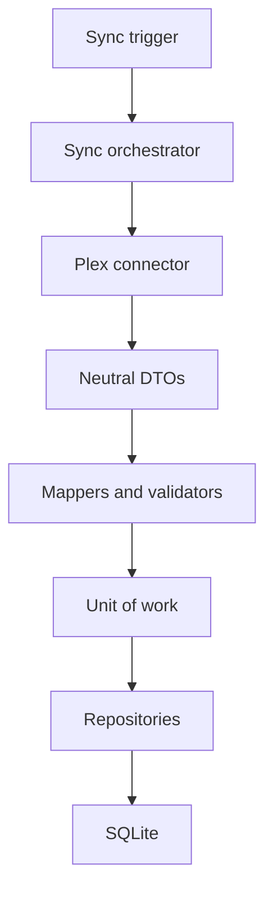

# euvieouvi v2 — Motor de Sincronização e Contratos do Plex

**Status:** Entrega 5 — aprovada em 4 de agosto de 2026  
**Data:** 4 de agosto de 2026  
**Base:** Entregas 1 a 4 aprovadas em 4 de agosto de 2026.

## 1. Objetivo

Definir o comportamento do motor que traz para o banco local filmes, séries, temporadas, episódios, estados assistidos e eventos conhecidos pelo Plex.

O desenho prioriza correção, retomada segura, idempotência e diagnóstico. Uma série parcialmente assistida nunca será descartada por não estar totalmente concluída. O estado de cada episódio é a unidade autoritativa para séries.

## 2. Princípios obrigatórios

1. Processar somente fontes e bibliotecas habilitadas.
2. Tratar filmes e episódios como unidades assistíveis independentes.
3. Nunca usar o estado agregado de uma série como condição para ignorar seus episódios.
4. Paginar todas as coleções potencialmente grandes.
5. Separar coleta externa, mapeamento, regras e persistência.
6. Manter o conector sem acesso ao banco.
7. Repetir páginas ou itens sem criar duplicidades.
8. Avançar checkpoint somente após persistência confirmada.
9. Isolar erro de item sem corromper o restante da execução.
10. Não fabricar eventos históricos que o Plex não forneceu.
11. Registrar contadores e motivos de skips relevantes.
12. Garantir apenas uma sincronização ativa por instalação.

## 3. Componentes do motor



### 3.1 `SyncOrchestrator`

Responsável por:

- adquirir exclusividade de execução;
- criar e atualizar `sync_runs`;
- carregar somente bibliotecas habilitadas e disponíveis;
- escolher fluxo de filme ou série;
- solicitar páginas ao connector;
- validar e persistir lotes;
- controlar checkpoints e contadores;
- finalizar a execução;
- converter interrupções e falhas em estado persistido.

### 3.2 `PlexConnector`

Responsável por:

- montar requisições autenticadas;
- testar conectividade e identidade do servidor;
- descobrir bibliotecas;
- obter páginas de filmes ou episódios;
- obter histórico quando disponível para a conta e servidor configurados;
- converter respostas Plex em DTOs neutros;
- normalizar paginação e erros externos.

### 3.3 Mappers e validators

Responsáveis por:

- validar campos obrigatórios dos DTOs;
- normalizar tipos, datas, durações e identificadores;
- construir ou localizar a hierarquia interna;
- calcular a chave de deduplicação quando necessária;
- classificar um item como novo, alterado, inalterado ou inválido.

### 3.4 Unidade de trabalho

Responsável por uma transação de lote. Repositories participam da sessão recebida, sem commit próprio. Erros isolados usarão savepoints quando tecnicamente apropriado, mantendo a transação externa controlada pelo service.

## 4. Contrato neutro do connector

O connector implementará uma interface equivalente a:

```python
class MediaConnector(Protocol):
    def test_connection(self) -> ConnectionInfo: ...
    def list_libraries(self) -> list[ExternalLibrary]: ...
    def get_media_page(
        self,
        library: ExternalLibraryRef,
        media_kind: MediaKind,
        page: PageRequest,
    ) -> Page[ExternalMediaItem]: ...
    def get_history_page(
        self,
        library: ExternalLibraryRef,
        checkpoint: HistoryCheckpoint | None,
        page: PageRequest,
    ) -> Page[ExternalWatchEvent]: ...
```

O formato final poderá usar classes concretas ou métodos adicionais internos, mas deverá preservar estas responsabilidades e não receber sessão ou repository.

## 5. DTO `ConnectionInfo`

| Campo | Tipo | Regra |
| --- | --- | --- |
| `server_name` | text | obrigatório |
| `server_identifier` | text | obrigatório e estável quando fornecido |
| `server_version` | text | opcional |
| `authenticated` | boolean | obrigatório |
| `capabilities` | conjunto | recursos detectados |

O teste será leve e não sincronizará bibliotecas. Falha de autenticação será diferente de indisponibilidade de rede.

## 6. DTO `ExternalLibrary`

| Campo | Tipo | Regra |
| --- | --- | --- |
| `external_id` | text | obrigatório |
| `name` | text | obrigatório |
| `media_type` | `movie` ou `show` | obrigatório |
| `available` | boolean | obrigatório |
| `source_updated_at` | datetime UTC | opcional |

Tipos de biblioteca fora do escopo serão devolvidos como não suportados ou filtrados com motivo explícito; nunca serão cadastrados silenciosamente como filme ou série.

## 7. DTO `ExternalMediaItem`

| Campo | Tipo | Regra |
| --- | --- | --- |
| `external_id` | text | identidade estável usada pelo connector |
| `external_key` | text | chave específica opcional |
| `library_external_id` | text | obrigatório |
| `kind` | movie/show/season/episode | obrigatório |
| `title` | text | obrigatório |
| `original_title` | text | opcional |
| `year` | integer | opcional |
| `show_external_id` | text | obrigatório para episódio |
| `show_title` | text | obrigatório para episódio |
| `season_external_id` | text | obrigatório para episódio quando fornecido |
| `season_number` | integer | obrigatório para episódio |
| `episode_number` | integer | obrigatório para episódio |
| `duration_ms` | integer | opcional |
| `originally_available_on` | date | opcional |
| `summary` | text | opcional |
| `identifiers` | lista | IDs informados pela fonte |
| `updated_at` | datetime UTC | opcional |
| `last_viewed_at` | datetime UTC | opcional |
| `view_count` | integer | padrão zero quando inequivocamente ausente |
| `view_offset_ms` | integer | opcional |

Campos ausentes não serão convertidos automaticamente em valores que alterem estado. O mapper distingue “ausente” de zero ou falso quando essa diferença for relevante.

## 8. DTO `ExternalWatchEvent`

| Campo | Tipo | Regra |
| --- | --- | --- |
| `source_event_id` | text | opcional |
| `media_external_id` | text | obrigatório |
| `library_external_id` | text | obrigatório ou resolvível com segurança |
| `watched_at` | datetime UTC | obrigatório para evento real |
| `completed` | boolean | obrigatório |
| `progress_ms` | integer | opcional |
| `duration_ms` | integer | opcional |
| `view_number` | integer | opcional |

Se o Plex fornecer somente estado agregado, o connector não criará este DTO. Produzirá apenas os campos de estado em `ExternalMediaItem`, destinados a `watch_states`.

## 9. Contrato de paginação

### 9.1 `PageRequest`

- `start`: posição inicial não negativa;
- `size`: tamanho positivo limitado pela configuração;
- `cursor`: opcional para fontes que ofereçam cursor opaco.

### 9.2 `Page[T]`

- `items`;
- `start`;
- `size` efetivamente retornado;
- `total_size`, quando informado;
- `next_start` ou `next_cursor`;
- `has_more` calculado de forma defensiva.

### 9.3 Regras

- O connector Plex encapsulará os parâmetros `X-Plex-Container-Start` e `X-Plex-Container-Size` documentados pelo Plex.
- O motor não dependerá do nome desses parâmetros.
- Página vazia encerra a enumeração.
- Quando `total_size` existir, será usado para contadores e validação, mas não como única condição de término.
- Se a fonte repetir a mesma página, o connector detectará ausência de avanço e falhará de forma controlada.
- O tamanho inicial proposto é 200 itens e será configurável após testes; não integra o contrato permanente.

## 10. Autenticação e requisições Plex

- A credencial será enviada pelo connector usando o mecanismo aceito pelo Plex, preferencialmente em cabeçalho e nunca registrada em log.
- O cliente enviará identificação consistente da aplicação e versão.
- URL base será normalizada e validada antes do uso.
- Timeouts de conexão e leitura serão explícitos.
- Respostas não bem-sucedidas serão classificadas por categoria.
- Respostas XML ou JSON serão convertidas dentro do connector; nenhum formato Plex atravessa sua fronteira.
- Redirecionamentos não poderão enviar a credencial a destino não validado.

## 11. Descoberta de bibliotecas

1. O service carrega a fonte habilitada.
2. O connector testa a conexão ou usa conexão já validada na execução.
3. O connector lista seções do servidor.
4. Somente tipos de filme e série são mapeados.
5. O service faz upsert por `(source_id, external_id)`.
6. Bibliotecas encontradas recebem `available = true` e novo `last_seen_at`.
7. Bibliotecas anteriores não retornadas recebem `available = false`, após conclusão bem-sucedida da descoberta.
8. O campo `enabled` nunca será ativado automaticamente.
9. Nova descoberta não apagará seleção já existente para a mesma identidade.

Uma falha parcial na descoberta não marcará bibliotecas ausentes como indisponíveis.

## 12. Seleção de bibliotecas

Antes de iniciar uma execução, o motor consultará o banco e congelará a lista de bibliotecas com:

- fonte habilitada;
- biblioteca habilitada;
- biblioteca disponível;
- tipo suportado.

Alteração de seleção durante uma execução afetará apenas a execução seguinte. O snapshot da execução ficará registrado em `sync_run_libraries`.

## 13. Fluxo de sincronização inicial

### 13.1 Filmes

Para cada biblioteca habilitada de filmes:

1. enumerar todas as páginas de filmes;
2. mapear cada filme para DTO neutro;
3. validar identidade e campos mínimos;
4. localizar ou criar item interno e referência externa;
5. atualizar metadados normalizados;
6. persistir `watch_state` informado;
7. sincronizar eventos reais disponíveis pelo histórico;
8. confirmar lote e checkpoint;
9. atualizar contadores.

### 13.2 Séries

Para cada biblioteca habilitada de séries:

1. enumerar **episódios**, paginados, como unidades assistíveis;
2. usar os dados recebidos para localizar ou criar série e temporada;
3. criar ou atualizar o episódio;
4. persistir o estado assistido do episódio;
5. sincronizar eventos reais disponíveis;
6. confirmar lote e checkpoint;
7. atualizar contadores.

O motor poderá consultar metadados de série ou temporada para completar dados, mas isso não poderá substituir nem impedir a enumeração dos episódios.

## 14. Regra obrigatória para séries parcialmente assistidas

É proibida qualquer regra equivalente a:

- ignorar a série porque `viewed_leaf_count < leaf_count`;
- exigir que a série esteja marcada como assistida;
- ignorar filhos porque `view_count` da série é zero;
- usar somente `last_viewed_at` ou `updated_at` da série para decidir que nenhum episódio precisa ser verificado.

Exemplo de aceite: uma série com 161 episódios, dos quais 144 assistidos, deve produzir estado individual para os 144 episódios conhecidos como assistidos e manter os demais como não assistidos ou desconhecidos conforme a evidência recebida. A série não será tratada como um único evento.

## 15. Estratégia incremental

A incrementalidade terá duas dimensões independentes:

### 15.1 Coleta

- Quando o endpoint Plex oferecer filtro e ordenação confiáveis por atualização, o connector poderá solicitar somente a janela posterior ao checkpoint, com pequena sobreposição temporal.
- Quando essa garantia não existir, o connector paginará todos os itens da biblioteca e o motor aplicará skip individual barato.
- Correção tem prioridade sobre redução de chamadas.

### 15.2 Persistência

Um item será considerado candidato a skip somente quando:

- a referência externa já existir;
- os marcadores `updated_at`, `last_viewed_at`, `view_count` e progresso relevantes não indicarem mudança;
- a assinatura normalizada dos campos usados pelo domínio não tiver mudado;
- não houver necessidade pendente de recuperar eventos históricos.

Mesmo quando metadados de série estiverem inalterados, episódios continuarão sujeitos à sua própria decisão incremental.

## 16. Checkpoints

Cada biblioteca terá checkpoint próprio e estratégia identificada. O checkpoint poderá combinar:

- watermark temporal;
- último identificador usado como desempate;
- cursor opaco quando suportado;
- referência à última execução bem-sucedida.

Regras:

- a janela incremental terá sobreposição para evitar perdas na fronteira;
- a sobreposição pode reprocessar itens, por isso idempotência é obrigatória;
- checkpoint avança somente depois do commit do lote;
- se um item falhar, o checkpoint não ultrapassará a posição que impediria sua nova leitura;
- ao mudar a estratégia ou invalidar o checkpoint, será executada reconciliação completa segura;
- checkpoint de catálogo e de histórico poderão ser separados internamente se os fluxos tiverem garantias diferentes.

## 17. Histórico assistido

O motor distinguirá:

### 17.1 Evento real

Uma ocorrência com mídia e horário conhecidos, persistida em `watch_events` e deduplicada por identidade externa ou chave determinística.

### 17.2 Estado agregado

Informação como `view_count`, `last_viewed_at`, progresso e flag assistida. Será persistida em `watch_states`.

Regras:

- `view_count = 4` com apenas um horário conhecido não gera quatro eventos;
- o horário conhecido poderá formar evento somente se a resposta representar efetivamente uma ocorrência histórica;
- marcação manual como assistido será preservada conforme a evidência fornecida, sem inventar duração reproduzida;
- redução de `view_count` será registrada e tratada por reconciliação, não aplicada silenciosamente como perda de histórico.

## 18. Lotes, savepoints e commits

- Páginas externas serão convertidas em lotes de persistência configuráveis.
- Cada item será processado em savepoint para permitir rollback isolado de dados inválidos.
- Itens válidos do lote poderão ser preservados mesmo que outro item falhe.
- O commit externo confirmará o conjunto válido, seus contadores e o progresso permitido.
- Se um erro impedir avanço seguro, a execução terminará `failed`, ainda que itens anteriores tenham sido confirmados.
- Reexecução deverá reler a região não confirmada e ignorar idempotentemente os itens já persistidos.
- Não haverá commit escondido dentro de repositories ou mappers.

O tamanho final do lote será definido por teste. Commit por item não será o padrão porque fragmenta a unidade de checkpoint; o isolamento por item será obtido com savepoint.

## 19. Classificação de itens

Cada item lido incrementará exatamente uma classificação principal:

- `inserted`;
- `updated`;
- `unchanged`;
- `failed`.

Motivos de `unchanged` ou skip serão categorizados, por exemplo:

- marcadores e assinatura sem mudança;
- biblioteca fora do snapshot da execução;
- tipo não suportado;
- evento já conhecido;
- item indisponível confirmado.

Biblioteca desabilitada nem sequer será solicitada ao Plex e não entra como item ignorado.

## 20. Contadores e resultado

Por execução e biblioteca:

- páginas solicitadas;
- itens lidos;
- itens inseridos;
- itens atualizados;
- itens inalterados;
- itens com erro;
- eventos inseridos;
- eventos duplicados ignorados;
- duração;
- último checkpoint confirmado.

Esses contadores são operacionais. Estatísticas avançadas de consumo continuam fora desta entrega.

## 21. Tratamento de indisponibilidade

Um item externo somente será marcado `available = false` após uma varredura completa e bem-sucedida da biblioteca que permita concluir sua ausência.

- execução incremental parcial não marca ausências;
- erro de página não marca itens posteriores como ausentes;
- biblioteca desabilitada não altera disponibilidade de seus itens;
- item indisponível não perde metadados, eventos ou estado local;
- retorno do mesmo identificador reativa a referência existente.

## 22. Retries e timeouts

- Timeouts de conexão e leitura serão finitos e configurados no cliente.
- Erros transitórios elegíveis terão poucas tentativas com backoff exponencial e jitter.
- Erros de autenticação, validação ou recurso inexistente não serão repetidos automaticamente.
- Respostas de limitação respeitarão indicação do servidor quando disponível.
- Retry de página inteira dependerá de idempotência.
- O número exato de tentativas será configurável e validado em testes.

## 23. Cancelamento e interrupção

- O executor verificará pedido de cancelamento entre páginas e lotes.
- O lote já em commit não será interrompido no meio.
- Cancelamento solicitado terminará em estado compatível definido antes da implementação; até inclusão de um estado próprio no banco, será registrado como `interrupted` com motivo.
- Encerramento do contêiner deixará dados confirmados intactos.
- Na próxima inicialização, execução ativa órfã será marcada `interrupted`.

## 24. Logs

Eventos mínimos:

- início e fim da execução;
- snapshot de bibliotecas habilitadas;
- início e fim de cada biblioteca;
- página solicitada e quantidade retornada;
- progresso agregado periódico;
- skips incrementais por categoria em nível apropriado;
- falha de item com identidade sanitizada;
- retry e motivo;
- checkpoint confirmado;
- resumo final.

Token, URL autenticada, payload completo e dados sensíveis não serão registrados.

## 25. Erros padronizados do connector

- `ConnectorConfigurationError`;
- `ConnectorAuthenticationError`;
- `ConnectorConnectionError`;
- `ConnectorTimeoutError`;
- `ConnectorRateLimitError`;
- `ConnectorNotFoundError`;
- `ConnectorResponseError`;
- `ConnectorPaginationError`.

O motor decidirá retry e estado final com base na categoria, não em texto de exceção.

## 26. Testes obrigatórios

### 26.1 Connector

- autenticação aceita e recusada;
- descoberta de bibliotecas;
- XML e JSON representativos quando suportados;
- paginação com uma, várias e última página vazia;
- total informado incorretamente;
- página repetida sem avanço;
- timeout e resposta inválida;
- mapeamento de filme e episódio;
- campos opcionais ausentes.

### 26.2 Motor

- somente bibliotecas habilitadas são consultadas;
- seleção alterada durante execução vale apenas na próxima;
- primeira sincronização vazia e com dados;
- repetição idempotente;
- item alterado e inalterado;
- erro isolado por item;
- erro de página;
- falha antes e depois do commit;
- checkpoint não avança sobre falha;
- retomada após interrupção;
- deduplicação de eventos;
- estado agregado não fabrica eventos;
- indisponibilidade somente após varredura completa.

### 26.3 Caso de regressão obrigatório: série parcial

Fixture equivalente a:

- série `Futurama`;
- `leaf_count = 161`;
- `viewed_leaf_count = 144`;
- episódios com estados mistos;
- metadados da série sem alteração recente em um dos cenários.

Resultado esperado:

- os episódios são enumerados;
- os 144 assistidos são persistidos individualmente conforme a evidência;
- episódios não assistidos não são convertidos em assistidos;
- a série não é ignorada por estar incompleta;
- reexecução sem mudanças é idempotente.

## 27. Teste de validação com Plex real

Após a suíte automatizada:

1. configurar um servidor Plex de teste ou biblioteca pequena;
2. selecionar apenas essa biblioteca;
3. executar sincronização inicial;
4. comparar contagens de filmes ou episódios e estados assistidos;
5. repetir sem mudanças e verificar skips/idempotência;
6. assistir ou marcar um item;
7. executar novamente e confirmar atualização incremental;
8. interromper uma execução controlada e validar retomada segura;
9. somente depois testar biblioteca grande.

## 28. Agendamento

O motor suporta gatilhos manuais e por API aprovados. Agendamento automático periódico não será introduzido nesta entrega porque não consta nos documentos de escopo e infraestrutura aprovados. Sua inclusão futura exigirá decisão documentada sobre intervalo, recuperação e concorrência, reutilizando o mesmo `SyncOrchestrator`.

## 29. Fontes técnicas oficiais consultadas

- [Plex Media Server API](https://developer.plex.tv/pms/) — documentação oficial do servidor, incluindo paginação de `MediaContainer` por `X-Plex-Container-Start` e `X-Plex-Container-Size`.
- [Plex: Sync Watch State and Ratings](https://support.plex.tv/articles/sync-watch-state-and-ratings/) — distinção conceitual entre estado assistido e histórico de alterações/visualizações.

Detalhes que a documentação oficial não garantir de forma estável permanecerão encapsulados no connector e cobertos por fixtures de versões suportadas, em vez de se tornarem contrato do núcleo.

## 30. Decisões que exigiriam alteração formal

- ignorar episódios com base no estado agregado da série;
- consultar bibliotecas desabilitadas;
- permitir o connector gravar no banco;
- avançar checkpoint antes do commit;
- remover paginação;
- fabricar eventos a partir de contagem agregada;
- executar sincronizações concorrentes;
- incluir outro connector;
- adicionar agendamento automático sem documentá-lo;
- converter erros isolados em perda silenciosa de dados.

## 31. Critérios de aprovação desta entrega

Esta entrega estará aprovada quando houver concordância explícita sobre:

- componentes e fronteiras do motor;
- DTOs neutros;
- contrato defensivo de paginação;
- descoberta e seleção de bibliotecas;
- fluxos separados de filmes e episódios;
- regra para séries parcialmente assistidas;
- incrementalidade por item e checkpoints;
- distinção entre histórico e estado agregado;
- lotes, savepoints e commits;
- contadores, retries, erros e logs;
- testes, incluindo a regressão `Futurama`;
- ausência de agendamento automático nesta etapa.

Após a aprovação, a próxima entrega será **API REST**.
