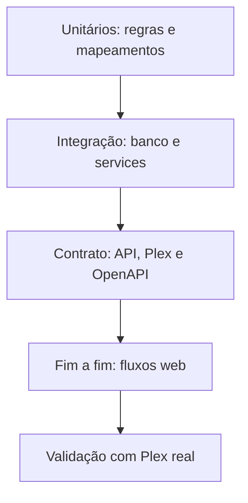

# euvieouvi v2 — Segurança, Testes e Roadmap de Implementação

**Status:** Entrega 8 — aprovada em 4 de agosto de 2026  
**Data:** 4 de agosto de 2026  
**Base:** Entregas 1 a 7 aprovadas em 4 de agosto de 2026.

## 1. Objetivo

Encerrar a fase de documentação e transformar as decisões aprovadas em uma sequência controlada de implementação. Este documento define o modelo de ameaça, controles mínimos, estratégia de testes, portões de qualidade, critérios de release e ordem de construção.

A aprovação desta entrega congela a documentação-base da primeira versão funcional. A implementação poderá esclarecer detalhes internos, mas não alterar o conceito, as fronteiras ou o escopo sem mudança formal.

## 2. Perfil da instalação

O `euvieouvi v2` é uma aplicação self-hosted para uso pessoal, executada em contêiner e normalmente acessada na rede local ou por proxy reverso controlado pelo operador.

Premissas:

- não há autenticação interna nesta versão;
- o operador controla o host, o Docker e o volume;
- o Plex pode estar na mesma rede privada;
- a aplicação precisa realizar requisições ao endereço Plex configurado;
- o histórico local e o token Plex são dados sensíveis;
- exposição direta à internet não é um cenário suportado.

## 3. Ativos protegidos

- token Plex;
- URL e identidade do servidor Plex;
- histórico de filmes e episódios assistidos;
- banco SQLite e backups;
- seleção de bibliotecas;
- integridade dos checkpoints;
- logs, que podem revelar hábitos e nomes de conteúdo;
- cadeia de build e dependências;
- disponibilidade da instalação.

## 4. Ameaças consideradas

### 4.1 Acesso HTTP não autorizado

Como não há autenticação interna, qualquer pessoa que alcance a aplicação poderá consultar dados e acionar operações permitidas. Mitigação operacional: rede confiável, firewall e proxy reverso protegido.

### 4.2 Vazamento de token Plex

Possíveis vetores:

- logs;
- respostas API;
- HTML;
- query strings;
- arquivos versionados;
- mensagens de erro;
- backup exposto.

### 4.3 CSRF

Uma página externa pode tentar enviar requisições ao serviço acessível pela rede local. Todas as web routes de escrita terão proteção CSRF.

### 4.4 SSRF e destino Plex configurável

A aplicação precisa aceitar endereços privados e até `localhost` em instalações válidas, portanto não poderá bloquear genericamente redes privadas.

Controles:

- somente esquemas HTTP e HTTPS;
- rejeição de credenciais embutidas na URL;
- rejeição de fragmentos e formatos ambíguos;
- portas válidas;
- timeouts explícitos;
- redirecionamentos limitados e validados;
- token nunca encaminhado para host diferente do configurado sem validação explícita;
- nenhuma URL arbitrária fornecida por filtros ou endpoints públicos.

### 4.5 Injeção

- SQL somente por SQLAlchemy e parâmetros vinculados;
- nenhuma concatenação de filtros em SQL;
- Jinja com escape automático;
- nenhuma renderização direta de HTML retornado pelo Plex;
- validação fechada de enumerações, sort e filtros;
- nenhum comando de shell construído com entrada do usuário.

### 4.6 Corrupção ou perda do banco

- transações e foreign keys;
- checkpoint após commit;
- migrações versionadas;
- backup consistente;
- teste de restauração;
- encerramento controlado;
- volume persistente.

### 4.7 Dependência vulnerável ou imagem comprometida

- dependências com versões controladas;
- origem oficial ou confiável;
- auditoria automatizada;
- imagem base fixada e atualizada deliberadamente;
- build reproduzível;
- usuário não root;
- nenhuma ferramenta de desenvolvimento desnecessária na imagem final.

### 4.8 Negação de serviço acidental

- paginação obrigatória;
- limite de corpo e filtros;
- uma sincronização por vez;
- timeouts e retries limitados;
- listas locais paginadas;
- polling moderado;
- payload externo não persistido integralmente.

## 5. Controles de segredo

- Token aceito apenas nos fluxos de criação ou alteração da fonte.
- API e UI devolvem somente `has_secret`.
- Campo de edição vazio preserva o token existente.
- Configuração de log possui redaction defensiva.
- URLs de log removem query strings sensíveis.
- Fixtures nunca contêm token real.
- `.env`, banco, backups e arquivos locais ficam fora do Git.
- Imagem Docker não contém credenciais.
- Arquivos persistentes recebem permissões compatíveis com o usuário da aplicação.
- Backup deve ser tratado com a mesma sensibilidade do banco.

O token permanecerá protegido pelas permissões do volume. Criptografia reversível sem uma chave externa não será apresentada como segurança adicional real nesta versão.

## 6. Segurança HTTP e navegador

### 6.1 Cabeçalhos

Quando compatíveis com o ambiente:

- `Content-Security-Policy` restrita a assets locais;
- `X-Content-Type-Options: nosniff`;
- `Referrer-Policy` conservadora;
- proteção contra framing, preferencialmente por CSP `frame-ancestors`;
- `Permissions-Policy` mínima;
- HSTS somente quando a aplicação estiver corretamente publicada por HTTPS e o proxy for confiável.

### 6.2 Cookies e sessão

- `HttpOnly`;
- `SameSite=Lax` ou mais restrito quando compatível;
- `Secure` sob HTTPS;
- chave secreta da aplicação fornecida por configuração operacional;
- sessão usada apenas para necessidades da web, não como armazenamento de regra de negócio.

### 6.3 CORS

- desabilitado por padrão;
- mesma origem para web UI;
- nenhuma origem curinga;
- mudança exige caso de uso e aprovação formal.

### 6.4 CSRF

- obrigatório para formulários e HTMX de escrita;
- falha retorna mensagem segura e não altera estado;
- token não aparece em URL ou log.

## 7. Validação e limites

- Schemas explícitos para API e formulários.
- Campos desconhecidos rejeitados.
- Strings com limites definidos.
- URLs analisadas por parser, não por expressão regular isolada.
- Enumerações fechadas.
- IDs internos inteiros positivos.
- Datas e intervalos validados.
- Limite máximo de 200 itens por página.
- Limite de corpo HTTP.
- Respostas Plex com limites de leitura e timeout.
- Mensagens externas tratadas como dados não confiáveis.

## 8. Logs e privacidade

Logs operacionais conterão apenas o necessário para diagnóstico:

- request ID;
- componente;
- fonte e biblioteca por ID interno;
- identidade externa sanitizada quando necessária;
- contadores;
- duração;
- categoria de erro.

Não conterão:

- token;
- corpo de configuração;
- payload Plex completo;
- cabeçalho de autorização;
- cookies;
- SQL com valores sensíveis;
- stack trace enviado ao navegador.

O nível de debug continuará sujeito à mesma redaction.

## 9. Dependências e cadeia de build

- Dependências de produção e desenvolvimento declaradas separadamente.
- Lock ou resolução reproduzível documentada.
- Verificação de vulnerabilidades conhecidas no pipeline.
- Licenças incompatíveis serão evitadas.
- Build Docker executado em ambiente limpo.
- `.dockerignore` impede inclusão de banco, Git, testes temporários e segredos.
- Imagem final inspecionada para confirmar usuário não root e ausência de arquivos indevidos.
- Atualizações de dependência ocorrerão em changes próprios, com testes completos.

Nenhum download de código ocorrerá durante a inicialização do contêiner de produção.

## 10. Estratégia geral de testes

A maioria dos testes será rápida e independente do Plex real. Testes reais serão um portão controlado antes de validar bibliotecas grandes.

## 11. Testes unitários

Cobertura obrigatória:

- validação e normalização dos DTOs;
- hierarquia de mídia;
- mapeamento Plex;
- classificação inserted/updated/unchanged/failed;
- decisões incrementais;
- deduplicação de eventos;
- distinção entre evento e estado agregado;
- cálculo de cursor local;
- classificação de erros e retries;
- sanitização de segredos;
- validação de URL Plex;
- regras de seleção de bibliotecas;
- regras de cancelamento.

Unitários não acessam rede, banco real ou Flask app completa quando isso não for necessário.

## 12. Testes de integração

- migração inicial em SQLite vazio;
- upgrade de migrações futuras;
- pragmas e foreign keys;
- repositories e índices;
- transações, savepoints e rollback;
- idempotência de lote;
- checkpoint após commit;
- falha antes do commit;
- executor local;
- exclusividade de sincronização;
- reconciliação após reinício;
- services com connector fake;
- backup e restauração;
- application factory e configurações.

Cada teste usa banco isolado e descartável.

## 13. Testes do connector Plex

Fixtures sanitizadas representarão:

- descoberta de bibliotecas;
- filmes;
- séries, temporadas e episódios;
- campos opcionais ausentes;
- itens não assistidos, em andamento e concluídos;
- histórico real;
- estado agregado sem histórico completo;
- múltiplas páginas;
- página vazia final;
- total incorreto;
- página repetida;
- erro de autenticação;
- timeout;
- resposta inválida;
- variações suportadas de XML ou JSON.

O contrato neutro será testado; nenhum teste de service dependerá de objeto específico do Plex.

## 14. Regressão obrigatória `Futurama`

O caso de regressão permanecerá na suíte durante toda a vida da v2:

- 161 episódios conhecidos;
- 144 assistidos;
- série não totalmente concluída;
- episódios mistos;
- cenário em que metadados agregados da série não indicam mudança suficiente.

Aceite:

- todos os episódios relevantes são enumerados;
- 144 estados assistidos são preservados individualmente;
- episódios restantes não são marcados indevidamente;
- série não é ignorada;
- segunda execução é idempotente;
- mudança de um episódio é detectada sem exigir conclusão da série.

## 15. Testes de API

- `openapi.yaml` válido;
- respostas críticas compatíveis com schemas;
- status HTTP;
- formato de erro;
- paginação e cursor;
- filtros e ordenação permitidos;
- campos desconhecidos;
- tamanho de corpo;
- fonte e token write-only;
- descoberta e seleção;
- início, conflito, polling e cancelamento;
- catálogo, eventos e estados;
- readiness independente do Plex;
- CORS desabilitado;
- erros internos sanitizados.

## 16. Testes da interface

- primeiro acesso;
- edição de fonte sem reexibir token;
- conexão válida e inválida;
- bibliotecas disponíveis e indisponíveis;
- primeira sincronização;
- execução ativa com polling;
- cancelamento;
- dashboard vazio e populado;
- filtros e paginação do histórico;
- detalhes de filme e episódio;
- série parcial;
- fallback sem HTMX;
- CSRF;
- teclado, foco e regiões dinâmicas;
- celular, tablet e desktop.

## 17. Testes de segurança

- token ausente em logs, HTML e respostas;
- token não incluído em exceções do cliente Plex;
- URL com credencial rejeitada;
- redirecionamento para outro host não recebe token;
- schemes não permitidos rejeitados;
- SQL injection em filtros;
- XSS em títulos e mensagens externas;
- CSRF ausente, inválido e reutilizado conforme política;
- CORS e cabeçalhos;
- proxy headers não confiáveis;
- arquivo `.env`, banco e backup ausentes da imagem;
- processo do contêiner sem root;
- dependências auditadas;
- limite de corpo e paginação.

## 18. Testes de desempenho e volume

Sem estabelecer meta de grande plataforma, a validação deverá cobrir:

- biblioteca pequena para correção;
- milhares de filmes;
- série com centenas de episódios;
- biblioteca de séries com muitos episódios;
- histórico com muitos eventos;
- repetição incremental sem mudanças;
- alteração de pequena fração dos itens;
- consultas paginadas do dashboard e histórico;
- concorrência entre leitura da UI e sincronização única;
- duração de commits e crescimento do WAL.

Métricas observadas:

- tempo total;
- páginas e itens por segundo;
- tempo por lote;
- tamanho do banco e WAL;
- memória máxima;
- tempo de consultas principais;
- quantidade de retries e locks.

O tamanho de página e lote somente será congelado após esses testes.

## 19. Teste com Plex real

Ordem obrigatória:

1. subir ambiente isolado;
2. configurar Plex de teste ou servidor real com biblioteca pequena selecionada;
3. executar descoberta;
4. executar sincronização inicial;
5. comparar itens e estados;
6. repetir sem mudanças;
7. alterar um filme e um episódio;
8. testar série parcial;
9. simular indisponibilidade e retomada;
10. interromper contêiner durante execução;
11. validar reconciliação e checkpoint;
12. somente então habilitar biblioteca grande.

O token usado no teste não entrará em fixture ou relatório.

## 20. Cobertura e qualidade

Cobertura será usada como sinal, não como substituto de casos relevantes.

Regras:

- nenhum caminho crítico sem teste;
- regressão acompanha toda correção de bug;
- services, mappers e checkpoints exigem cobertura forte de ramos;
- testes não serão enfraquecidos apenas para aumentar percentual;
- código novo não reduz o nível de confiança do módulo;
- suíte deve ser determinística e independente de ordem;
- testes lentos serão marcados, mas executados antes de release.

## 21. Pipeline de qualidade

Cada change de implementação deverá executar:

1. formatação verificada;
2. lint;
3. verificação de tipos;
4. testes unitários;
5. testes de integração;
6. validação de migrações;
7. validação do OpenAPI;
8. testes de segurança automatizáveis;
9. auditoria de dependências;
10. build da imagem;
11. smoke test do contêiner e healthchecks.

Antes de release:

- testes web principais;
- backup/restauração;
- atualização preservando volume;
- Plex real em biblioteca pequena;
- caso `Futurama`;
- teste de volume;
- revisão dos documentos e instruções.

## 22. Definition of Done por funcionalidade

Uma funcionalidade estará concluída quando:

- respeitar a documentação aprovada;
- possuir implementação na camada correta;
- possuir migração quando alterar persistência;
- possuir testes unitários e/ou de integração adequados;
- não expor segredo;
- registrar erros de forma segura;
- atualizar OpenAPI quando afetar API;
- funcionar sem dependência externa não aprovada;
- possuir documentação operacional quando necessário;
- passar o pipeline completo relacionado.

## 23. Estratégia de branches e changes

- Changes pequenos, coerentes e revisáveis.
- Uma fase não mistura refatoração estrutural não prevista.
- Migração e model correspondente no mesmo change.
- Endpoint, schema, service e testes entregues juntos.
- Correção de bug inclui regressão.
- Dependências novas exigem justificativa.
- Arquivos gerados não substituem fonte versionada.

O fluxo Git específico poderá seguir o repositório usado pelo projeto; esta entrega não impõe provedor ou política organizacional externa.

## 24. Roadmap de implementação

### Fase 0 — Congelamento documental

Entregáveis:

- oito documentos aprovados;
- índice dos documentos;
- backlog separado para itens adiados.

Portão: nenhuma pendência conceitual necessária para iniciar a base.

### Fase 1 — Fundação do projeto

Entregáveis:

- estrutura de diretórios;
- `pyproject.toml`;
- application factory;
- configuração;
- extensões vazias;
- tratamento básico de erros;
- logging e request ID;
- testes iniciais;
- lint, tipos e pipeline local.

Portão: aplicação de teste inicia e suíte básica passa.

### Fase 2 — Infraestrutura executável

Entregáveis:

- Dockerfile;
- compose;
- usuário não root;
- volume;
- Gunicorn;
- entrypoint controlado;
- liveness e readiness iniciais;
- smoke test.

Portão: recriar contêiner preserva volume e healthchecks passam.

### Fase 3 — Banco e repositories

Entregáveis:

- models aprovados;
- migração inicial;
- pragmas SQLite;
- repositories;
- unidade de trabalho;
- fixtures e testes de integridade;
- backup/restauração inicial.

Portão: idempotência, rollback, foreign keys e migrações validados.

### Fase 4 — Contratos e connector Plex

Entregáveis:

- DTOs neutros;
- interface do connector;
- cliente Plex;
- autenticação e timeouts;
- descoberta;
- paginação;
- mappers;
- fixtures sanitizadas;
- testes de contrato.

Portão: connector devolve DTOs corretos sem importar banco ou repositories.

### Fase 5 — Motor de sincronização

Entregáveis:

- orquestrador;
- executor local;
- exclusividade;
- filmes;
- episódios e hierarquia;
- estados e eventos;
- lotes e savepoints;
- checkpoints;
- contadores e erros;
- cancelamento e reconciliação;
- regressão `Futurama`.

Portão: suíte completa do motor passa e teste pequeno simulado é idempotente.

### Fase 6 — API REST

Entregáveis:

- `openapi.yaml`;
- schemas;
- endpoints de fonte e bibliotecas;
- endpoints de sincronização;
- catálogo, eventos, estados e dashboard;
- paginação;
- erros padronizados;
- testes de contrato e segurança.

Portão: OpenAPI válido e fluxos da API passam sem segredo em respostas.

### Fase 7 — Interface Web

Entregáveis:

- layout e assets locais;
- primeiro acesso;
- configurações Plex;
- bibliotecas;
- dashboard;
- sincronizações com polling;
- histórico;
- detalhes de mídia;
- CSRF;
- responsividade e acessibilidade.

Portão: fluxos principais funcionam com HTMX e navegação tradicional.

### Fase 8 — Integração e endurecimento

Entregáveis:

- teste Plex real pequeno;
- teste de interrupção;
- backup/restauração;
- atualização de imagem;
- teste de volume;
- auditoria de dependências;
- revisão de logs e segredos;
- documentação de instalação e operação.

Portão: todos os critérios da primeira versão funcional são atendidos.

### Fase 9 — Release inicial

Entregáveis:

- versão `2.0.0`;
- imagem reproduzível;
- compose validado;
- changelog;
- instruções de instalação, atualização, backup e restauração;
- limitações conhecidas;
- checklist de validação pós-instalação.

Portão: release pode ser instalada do zero e atualizada preservando dados.

## 25. Ordem de arquivos e módulos

A criação seguirá dependências reais, não nomes do protótipo anterior:

1. configuração, factory e extensões;
2. tipos, enums e erros do domínio;
3. models e migração;
4. interfaces e repositories;
5. DTOs e interface de connector;
6. cliente, mapper e connector Plex;
7. services de fonte e bibliotecas;
8. unidade de trabalho e motor;
9. executor e reconciliação;
10. schemas e API;
11. web routes e templates;
12. assets e refinamento visual;
13. documentação operacional.

Arquivos serão subdivididos apenas quando possuírem responsabilidade concreta.

## 26. Backlog explicitamente adiado

- agendamento automático, inclusive execução horária;
- autenticação, usuários e roles;
- múltiplos usuários Plex;
- TMDb;
- Trakt;
- outros connectors;
- estatísticas avançadas;
- recomendações;
- capas e imagens externas;
- edição manual do histórico;
- frontend SPA;
- WebSocket ou SSE;
- tema escuro;
- internacionalização completa;
- backup automático;
- PostgreSQL ou outro banco servidor;
- múltiplas sincronizações concorrentes;
- aplicativo móvel.

Itens adiados não serão implementados “aproveitando” outra tarefa.

## 27. Controle de mudança

Durante a implementação, uma proposta será classificada como:

### Esclarecimento

Detalhe interno que não altera comportamento, escopo ou fronteira. Pode ser documentado no change.

### Correção

Ajuste necessário para cumprir o que já foi aprovado. Deve incluir teste de regressão.

### Mudança de escopo

Adiciona capacidade, altera conceito, troca tecnologia fundamental ou rompe contrato aprovado. Exige:

1. descrição;
2. motivo;
3. impacto nos documentos;
4. impacto em dados e compatibilidade;
5. aprovação explícita antes do código.

### Item futuro

Registrado no backlog sem alterar a versão atual.

## 28. Critérios para iniciar implementação

A implementação começa somente quando:

- esta Entrega 8 estiver aprovada;
- os sete documentos anteriores estiverem marcados como aprovados;
- o repositório de destino estiver definido ou criado;
- não houver solicitação de alteração estrutural pendente;
- a primeira fase estiver claramente delimitada.

O primeiro change será exclusivamente a **Fase 1 — Fundação do projeto**. Não conterá connector Plex, models finais improvisados ou interface antecipada.

## 29. Critérios de conclusão da v2 inicial

A primeira versão funcional estará concluída quando:

1. instalar por Docker de forma reproduzível;
2. persistir dados em volume;
3. configurar e testar Plex sem revelar token;
4. descobrir e selecionar bibliotecas;
5. sincronizar filmes e episódios paginados;
6. preservar séries parcialmente assistidas por episódio;
7. repetir sincronização de forma idempotente;
8. avançar checkpoint somente após commit;
9. sobreviver a reinício sem estado ativo órfão;
10. oferecer API e interface aprovadas;
11. consultar histórico local quando Plex estiver indisponível;
12. passar regressão `Futurama`;
13. passar backup/restauração e atualização;
14. operar sem root e sem segredos em logs;
15. possuir documentação de instalação e operação;
16. não conter recursos excluídos incorporados implicitamente.

## 30. Decisões que exigiriam alteração formal

- iniciar código antes da aprovação documental final;
- trocar Flask, HTMX, Bootstrap, SQLite ou Docker-first;
- introduzir autenticação interna;
- introduzir agendamento automático;
- criar outros connectors;
- alterar limites entre routes, services, repositories e connectors;
- remover testes de regressão essenciais;
- avançar checkpoint sem persistência confirmada;
- expor aplicação como segura para internet sem controle de acesso;
- adicionar funcionalidade do backlog durante outra fase.

## 31. Critérios de aprovação desta entrega

Esta entrega estará aprovada quando houver concordância explícita sobre:

- modelo de ameaça e limites operacionais;
- controles de segredo, HTTP, CSRF, SSRF, logs e dependências;
- estratégia e camadas de testes;
- regressão `Futurama` permanente;
- pipeline e Definition of Done;
- roadmap das fases 0 a 9;
- versão inicial `2.0.0`;
- backlog adiado;
- controle de mudança;
- critérios para iniciar e concluir a implementação.

Após a aprovação, a documentação-base estará encerrada e poderá começar a **Fase 1 — Fundação do projeto**.
